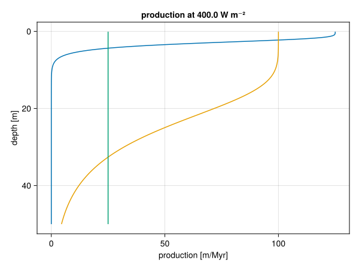
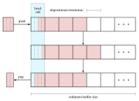
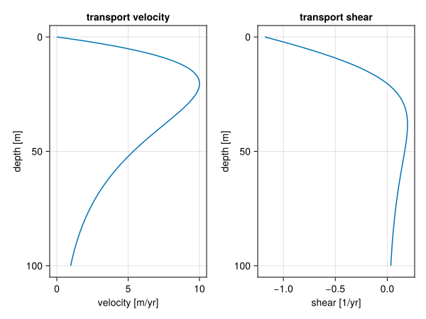

\newcommand{\term}[1]{\left(\frac{\partial \eta}{\partial t}\right)_{\textrm{#1}}}
\renewcommand{\[}{\begin{equation}}
\renewcommand{\]}{\end{equation}}

::: abstract
## Abstract
:::

## Introduction

Stratigraphic forward modelling is well established as a means of examining our understanding of the formation of stratal architectures (@burgess_numerical_2001, @schlager_record_2009, @ding_quantitative_2019, @jean_borgomano_quantitative_2020, @liu_formation_2022), prediction, correlation and imputation of architectures from incomplete data (@Warrlich2008), and testing hypotheses on the structure of the geological record (e.g., @kemp_stratigraphic_2018, @masiero_numerical_2020, @liu_estimating_2021) and the preservation of proxies (@curtis_natural_2025), fossils (@holland_quality_2000, @hannisdal_phenotypic_2006, @hohmann_identification_2024), or forcing mechanisms (@kemp_investigating_2016, @kemp_metre-scale_2019, @burgess_big_2019). Owing to their economic interest, most such models are proprietary to exploration companies and their availability to researchers is limited. Some older models developed by researchers share the fate of many other research software packages and their maintenance ceases, e.g. when a project ends (@Warrlich2000). It is not always possible to resuscitate such models, especially if documentation or license are lacking or code has not been shared (e.g., @demicco_cycopath_1998, @barrett_reef_2017). As a result, the choice of stratigraphic forward models available to researchers at the moment is narrow and shifted towards siliciclastic (@hutton_sedflux_2008, @sylvester_stratigraphy_2024) or specifically fluvial depositional systems (@wild_sedsim_2019, @falivene_three-dimensional_2019), to the point that researchers may resort to these models to create simulations of carbonate sections (@zimmt_recognizing_2021).

Modeling carbonate depositional systems requires not only accounting for water and atmospheric processes, but also for the biological character of sediment production and dispersal. Ecological processes, such as facilitation, competition and dispersal, may on one hand confound the relationships between sediment composition and water depth (e.g. @granjeon_concepts_1999, @dyer_quantifying_2018, @weij_limited_2019) and, on the other hand, lead to creation of complex facies patterns under stable sea level conditions (@drummond_self-organizing_1999, @purkis_spatial_2016, @xi_stratigraphic_2022). Complex models accounting for it have been mostly developed for exploration, e.g. `Carbonate 3D` (@warrlich_quantifying_2002, @Warrlich2008), `DIONISOS` (@granjeon_concepts_1999) and `Carbonate GPM` (@hill_modeling_2009). Of research-driven models operating in more than one dimension, two include a wider range of depositional environment with carbonate production modules: `SedSimple` (@tetzlaff_stratigraphic_2023) and `Badlands` (@salles_badlands_2016), including its Python interface `pyBadlands` (@salles_pybadlands_2018), but due to their general focus these models do not account for the spatial heterogeneity driven by biological processes. Finally, `CarboCAT` (@Burgess2013) is a research-driven 2D model dedicated to stratigraphic forward modeling of carbonate platforms, which includes a cellular automaton that approximates the spatial heterogeneity formed through ecological interactions between carbonate-producing organisms. `CarboCAT` has been used in multiple studies (e.g. @masiero_numerical_2020, @xi_stratigraphic_2022, @hohmann_identification_2024), but having been written in Matlab, it was not accessible to contributions from the entire scientific community. Based on the successful applications of `CarboCAT`, we set out to develop a new generation model with the following specifications:

1.  it should be Open Source and it should be easy for researchers to understand the algorithm, which is a prerequisite to being able to contribute to it or modify it to one's needs,

2.  it should allow for spatial heterogeneity of carbonate facies,

3.  it should include a sediment transport algorithm operating on different carbonate facies and produces realistic results without decreasing the model's performance substantially,

4.  it should allow exporting and plotting multiple types of data users may need, including slices through the model grid, age-depth models, sediment accumulation curves, and stratigraphic columns,

5.  it should be performant, easy to parallelize, and platform-independent,

6.  it should be well documented and easy to use at a level accessible to a geosciences student.

The above prerequisites led us to re-designing the original architecture of `CarboCAT` and implementing its successor in Julia. In this article we present `CarboKitten.jl`, an efficient and accessible Open Source model for stratigraphic forward simulations of tropical carbonate platforms.

## Model

### Quantities

Subsidence rate

:   Quantified as a rate $\sigma$ in units of $\textrm{m/Myr}$. The growth of sediment is only sustainable in scenarios where there is a steady subsidence. In our models we use a default value of $50 \textrm{m/Myr}$ (or $0.5 \textrm{mm/kyr}$).

Initial topography

:   The model starts at an initial topography $\eta_0(x) = \eta(x, t_0)$, consisting of impenetrable bedrock.

Topography

:   The present topography $\eta(x, t)$ is given as the initial topgraphy plus any amount of sediment accumulated over time. In our definition of $\eta$ we don't correct for subsidence (see also the definition for water depth below).

Relative sea level

:   The relative sea level $R(t)$ is usually a function of time, given as an input parameter of the model.

Water depth

:   The water depth is computed from the current topography, relative sea level and subsidence rate,

$$w(x, t) = R(t) - \eta(x, t) + \int_{t_0}^{t} \sigma \textrm{d}t.$$

### Carbonate Production

The general form of our production model follows that of @Bosscher1992 (BS92). This model finds the sediment accumulation curve by integrating an ODE that outside of the model parameters only depends on the initial topography.

$$\frac{\partial \eta}{\partial t} = P(\eta),$$

where $P$ is the sediment production in $\textrm{m/Myr}$,

$$P(w) = g_m \tanh\left(\frac{I_0 e^{-kw}}{I_k}\right),$$

where $I_0$ is the insolation, $I_k$ is the saturation intensity, $k$ the extinction coefficient and $g_m$ the maximum growth rate.

This model encapsulates both the exponential extinction of sun light as water depth increases, and the idea that the growth of organisms interpolates between no growth at great depth and saturated growth in shallow waters (i.e. solar input is not the limiting factor at those depths).

Here we parametrize $P$ as a function of $w$. Note that $\nabla w = - \nabla \eta$, but otherwise we'll use $w$ and $\eta$ wherever one or the other is more convenient.

Following @Burgess2013, we extend the BS92 model by introducing multiple facies that each have their own growth characteristics (except for insolation $I_0$, which is a global input variable).

$$P(w) = \sum_f P_f(w)$$

| Factory | $g_m$ $[\textrm{m}/\textrm{Myr}]$ | $I_k$ $[\textrm{W}/\textrm{m}^2]$ | $k$ $[\textrm{m}^{-1}]$ |
|----|----|----|----|
| Tropical | 500.0 | 60.0 | 0.8 |
| Mounds | 400.0 | 60.0 | 0.1 |
| Cool water | 100.0 | 60.0 | 0.005 |

: Parameters for the production model of the three default carbonate factories. {#tbl:factories}

Our default parameters define three biological facies based on sediment produced by three carbonate factories: the tropical (T), mounds (M) and cool water (C) factories. The default values for these factories are shown in Table @tbl:factories, and the resulting production curves shown in Figure @fig:factories.

{#fig:factories width="100%"}

FIXME: Add legend to figure showing which curve is Tropical, Mounds and Cool water factory.

::: hide
``` julia
#| id: bs92-input
const FACIES = [
    BS92.Facies(
         maximum_growth_rate=500u"m/Myr"/4,
         extinction_coefficient=0.8u"m^-1",
         saturation_intensity=60u"W/m^2"),
    BS92.Facies(
         maximum_growth_rate=400u"m/Myr"/4,
         extinction_coefficient=0.1u"m^-1",
         saturation_intensity=60u"W/m^2"),
    BS92.Facies(
         maximum_growth_rate=100u"m/Myr"/4,
         extinction_coefficient=0.005u"m^-1",
         saturation_intensity=60u"W/m^2")]

const INPUT = BS92.Input(
    tag = "example model BS92",
    box = CarboKitten.Box{Coast}(grid_size=(100, 1), phys_scale=150.0u"m"),
    time = TimeProperties(
        Δt = 200.0u"yr",
        steps = 5000,
        write_interval = 1),
    sea_level = t -> 4.0u"m" * sin(2π * t / 0.2u"Myr"),
    initial_topography = (x, y) -> - x / 300.0,
    subsidence_rate = 50.0u"m/Myr",
    insolation = 400.0u"W/m^2",
    facies = FACIES)
```

``` julia
#| classes: ["task"]
#| creates: ["md/fig/production-curves.svg"]
#| collect: figures

module Script
using CairoMakie
using CarboKitten
using CarboKitten.Visualization: production_curve!

<<bs92-input>>

function main()
  fig = Figure()
  ax = Axis(fig[1, 1])
  production_curve!(ax, INPUT)
  save("md/fig/production-curves.svg", fig)
end

end

Script.main()
```
:::

### Cellular Automaton

The Celullar Automaton (CA) in CarboKitten is a direct reimplementation of the one described by @Burgess2013 in their package CarboCAT.

The CA emulates the biological succession of species by following a set of simple rules. If conditions are right, a species will multiply and occupy neighbouring territory. However, when there are too many of the same kind, the species will die from over population.

For each cell in the grid a centered neighbourhood of $5\times 5$ pixels is considered. We count the number of neighbouring cells of the same species. Then we consider two ranges: the *activation range* (default $6 \le n \le 10$) and *viability range* (default $4 \le n \le 10$). If the number of live neighbours is in the viability range, the cell stays alive. If the cell was dead, but the number of live neighbours is in the activation range, the cell becomes alive.

Since a dead cell may qualify to become alive for different carbonate factories at the same time, birth priority is rotated every iteration.

In the default configuration we emulate three species, corresponding to the Tropical, Mound and Cool water species discussed in the section on carbonate production. The state of the CA determines which carbonate factory is switched on for each cell in the grid.

::: hide
``` julia
#| classes: ["task"]
#| creates: ["md/fig/ca-first-steps.svg"]
#| collect: figures

module Script
using CarboKitten
using CarboKitten.Components: CellularAutomaton as CA
using CairoMakie

function main()
  input = CA.Input(
      box = CarboKitten.Box{Periodic{2}}(
        grid_size=(50, 50), phys_scale=1.0u"m"),
      facies = fill(CA.Facies(), 3)
  )

  state = CA.initial_state(input)
  step! = CA.step!(input)
  
  fig = Figure(size=(1000, 500))
  axes_indices = Iterators.flatten(eachrow(CartesianIndices((2, 4))))
  xaxis, yaxis = box_axes(input.box)
  for (i, idx) in enumerate(axes_indices)
    ax = Axis(fig[Tuple(idx)...], aspect=AxisAspect(1), title="step $(i)")
    if idx[1] == 2
      ax.xlabel = "x [m]"
    end
    if idx[2] == 1
      ax.ylabel = "y [m]"
    end
    heatmap!(ax, xaxis/u"m", yaxis/u"m", state.ca)
    step!(state)
  end
  save("md/fig/ca-first-steps.svg", fig)
end

end

Script.main()
```

``` julia
#| classes: ["task"]
#| creates: ["md/fig/ca-long-term.svg"]
#| collect: figures
module Script
using CarboKitten
using CarboKitten.Components: CellularAutomaton as CA
using CairoMakie

function main()
  input = CA.Input(
      box = CarboKitten.Box{Periodic{2}}(
        grid_size=(50, 50), phys_scale=1.0u"m"),
      facies = fill(CA.Facies(), 3)
  )

  state = CA.initial_state(input)
  step! = CA.step!(input)

  for _ in 1:1000
    step!(state)
  end
  
  fig = Figure(size=(1000, 500))
  axes_indices = Iterators.flatten(eachrow(CartesianIndices((2, 4))))
  xaxis, yaxis = box_axes(input.box)
  i = 1000
  for row in 1:2
    for col in 1:4
      ax = Axis(fig[row, col], aspect=AxisAspect(1), title="step $(i)")
      
      if row == 2
        ax.xlabel = "x [m]"
      end
      if col == 1
        ax.ylabel = "y [m]"
      end

      heatmap!(ax, xaxis/u"m", yaxis/u"m", state.ca)
      step!(state)
      i += 1
    end
    for _ in 1:996
      step!(state)
      i += 1
    end
  end
  save("md/fig/ca-long-term.svg", fig)
end

end

Script.main()
```
:::

{width="100%"}

Figure: Iterations of the CA, as described by @Burgess2013, on a periodic grid of $50\times50$. Starting with random noise, we first iterate 1000 times to get into a typical state. The top row shows iterations 1000 to 1003, the bottom row 2000 to 2003. This shows that the patterns keep reasonably stable on the short term, while evolving more extensively over the long term. {#fig:ca}

### Transport

Our transport model is borrowed from other similar approaches in siliclastic (river bed) modeling [See @Paola1992; @James2010], where it is made plausible that this approach is viable for models that work on long time scales.

In the following, we may decompose the equation for sediment production as follows,

$$\frac{\partial \eta}{\partial t} = \left(\frac{\partial \eta}{\partial t}\right)_{\textrm{production}} + \left(\frac{\partial \eta}{\partial t}\right)_{\textrm{disintegration}} + \left(\frac{\partial \eta}{\partial t}\right)_{\textrm{transport}}$$

We consider all sediment transport to happen in an **active layer** close to the ocean floor. This layer has a certain concentration of sediment that travels along a path of steepest descent. We say that this material is **entrained**. We set the concentration of entrained material $C_f$ to be the sum of the production rate and the disintegration rate:

$$C_f = P_f + D_f.$$

We assume a local sediment flux,

$$\vec{q}_f = - C_f (d_f \vec{\nabla} \eta + \vec{v}_f(w)),$$

where $d_f$ is a facies dependent diffusivity, and $v(w)$ is a chosen additional velocity as a function of water depth. We use $v(w)$ to model wave induced sediment transport. The mass balance is then,

$$\left(\frac{\partial \eta}{\partial t}\right)_{\textrm{transport}} = -\sum_f \vec{\nabla} \cdot \vec{q}_f$$

This gives us a diffusion equation in $\eta$, but we can also view it as an advection equation for the sediment concentraiton $C_f$. We also express everything in terms of water depth, having $\nabla w = -\nabla \eta$, arriving at

$$
\frac{\partial C_f}{\partial t} = -(d_f \vec{\nabla} w + \vec{v}_f(w)) \cdot \vec{\nabla}C +
(\vec{s}_f(w) \cdot \vec{\nabla} w - d_f \nabla^2 w) C,
$${#eq:transport}

where $\vec{s}_f(w) = \vec{v}_f'(w)$ is the velocity shear, or the derivative of the velocity with respect to water depth. We solve this PDE using a finite difference method-of-lines approach with an explicit solver.

Other carbonate models [e.g. @Warrlich2000] take a very different approach, where matter is transported from unstable slopes to the nearest down-slope stable region. This method is motivated by critical angle theory [@Kenter1990].

The problem with these critical angle based methods of transport is that production across an unstable region all is deposited on a small strip where slopes are below the critical angle. It becomes unclear how to interpret these models from a physics point of view, as results depend heavily on the time-step that is chosen. Also, critical angle transport methods induce unstable behaviour. To resolve this, smaller time steps need to be taken, which hurts performance.

One aspect of critical angle theory that we do use, is that we can modulate the disintegration rate (and therefore the amount of entrained material) with the magnitude of the slope $|\nabla \eta|$.

### Composed model

Putting everything together, we evaluate the model as follows each iteration:

1.  Advance the cellular automaton.
2.  Compute the production $P_f$.
3.  Disintegrate sediment $D_f$.
4.  Transport entrained sediment $C_f$.
5.  Deposit entrained sediment.

Advancing the CA can be configured to happen one-in-$n$ iterations to slow it down. Transporting the sediment can be computed on smaller time steps if required for numeric stability.

## Software design

### Box topology

FIXME: give examples of runs with coast and island topologies.

### The sediment buffer

In our models of sediment transport and denudation it is important to remember the sedimentation history for all produced facies for some time into the past. We keep a three-dimensional fixed size buffer, where two dimensions represent the $x$ and $y$ coordinates of the system, and the third dimension discretizes the amount of deposited material. Each cell in the buffer represents a parcel of sediment, where we store the relative fractions of each contributing facies. We'd like to emphasise that this buffer is only used to determine the facies composition of disintegrated sediment. The sediment output of the overall model is written to disk at each iteration for post-analysis, but is no longer an active component in the model. This means that the model output can be much more precise than the depositional resolution of the buffer.

While the sediment buffer is allocated as a single 4-dimensional array (depth, facies, $x$, $y$), it is best to explain its functioning from the perspective of a single cell in our model. We are left with two dimensions: depth (rows) and facies (columns).

We choose to have the head of our sediment stack always be at the first row. When sediment out-grows the buffer, the deepest layers are dropped from memory. The head can contain an incomplete amount of sediment, while all rows below the head are either full or empty. When sediment is pushed to the stack and the head row overflows, all rows are copied down one row and the surplus is assigned to the now empty head row. The inverse happens when removing (popping) material from the stack. This process is illustrated below in Figure @fig:sediment-buffer.

{width="100%"}

Figure: Above we see a buffer. First we push a parcel of size $3/4$, then we pop an amount of $1/2$. This popped parcel will have different fractions from the pushed one, since it also draws from the half filled row that was in the stack before pushing. In this sense, a small amount of facies mixing will take place, depending on the depositional resolution chosen. {#fig:sediment-buffer}

Our implementation is such that each cell in the buffer is contiguous in memory. Thus, copying rows of unstrided memory should be very efficient, although the performance remains to be tested (FIXME).

### User interface

The user interfaces CarboKitten by writing a Julia script that defines the relevant model parameters and runs the chosen model. Effectively, very little Julia needs to be known to take an example input and modify parameters. Output is written to HDF5 files for post-processing and visualization.

CarboKitten ships with routines for visualisation and data extraction into CSV files. This makes it easier for novice users to use results from CarboKitten in further processing pipelines.

## Examples of use

### Variable sea level

### Wave induced transport

We model the transport by waves by setting the velocity $v_f$ and shear $s_f$ components in the transport Equation @eq:transport. Considering the long time-scales we're working with, we limit ourselves to highly simplified models of wave induced transport. We model the emergence of an atoll, starting with a conic topography, periodic boundaries and a sediment transport vector with a constant depth profile,

$$v_f = A_f \exp (- w k) \tanh (w k),$$

where $w$ is the water depth, $k$ the wave number ($k = 2\pi / \lambda$), and $A_f$ the facies dependent maximum transport velocity. The $k$ parameter can be tweaked to set the depth at which the maximum transport velocity is attained. We assume most of the sediment transport happens close to the sea floor. This profile is chosen for its assymptotic properties: at high water depth the transport velocity converges to zero, while the decrease in wave velocity towards shallow depths ensures that there is a net influx of material close to the shore. An example of this profile is shown in Figure @fig:wave-transport-magnitude.

{width="100%"}

Figure: Depth profile of velocity and shear. The velocity profile was taylored to have a maximum of $10 \textrm{m}/\textrm{yr}$ at a depth of $20 \textrm{m}$. Where the shear is non-zero, there is a net accumulation of sediment. {#fig:wave-transport-magnitude}

::: hide
``` julia
#| id: velocity-profile
v_prof(v_max, max_depth, w) = 
    let k = sqrt(0.5) / max_depth,
            A = 3.331 * v_max,
            α = tanh(k * w),
            β = exp(-k * w)
            (A * α * β, -A * k * β * (1 - α - α^2))
      end
```

``` julia
#| classes: ["task"]
#| creates: md/fig/wave-transport-magnitude.svg
#| collect: figures

module Script

using CairoMakie
using Unitful

<<velocity-profile>>

function main()
    w = LinRange(0, 100.0, 1000)u"m"
    f = v_prof.(10.0u"m/yr", 20.0u"m", w)

    v = first.(f)
    s = last.(f)
    
    fig = Figure()
    ax1 = Axis(fig[1, 1], title="transport velocity", yreversed=true, xlabel="velocity [m/yr]", ylabel="depth [m]")
    ax2 = Axis(fig[1, 2], title="transport shear", yreversed=true, xlabel="shear [1/yr]", ylabel="depth [m]")
    lines!(ax1, v / u"m/yr", w / u"m")
    lines!(ax2, s / u"1/yr", w / u"m")
    save("md/fig/wave-transport-magnitude.svg", fig)
end

end

Script.main()
```
:::

::: hide
``` julia
#| classes: ["task"]
#| creates: data/atoll.h5
#| collect: atoll
using CarboKitten

module Atoll

using CarboKitten
using GeometryBasics

<<velocity-profile>>

wave_velocity(v_max) = w -> let (v, s) = v_prof(v_max, 10.0u"m", w)
        (Vec2(v, 0.0u"m/Myr"), Vec2(s, 0.0u"1/Myr"))
    end

initial_topography(x, y) = 
    - sqrt((x - 7.5u"km")^2 + (y - 7.5u"km")^2) / 100.0

const FACIES = [
    ALCAP.Facies(
        viability_range=(4, 10),
        activation_range=(6, 10),
        maximum_growth_rate=500u"m/Myr",
        extinction_coefficient=0.8u"m^-1",
        saturation_intensity=60u"W/m^2",
        diffusion_coefficient=10.0u"m/yr",
        wave_velocity=wave_velocity(-0.5u"m/yr")),
    ALCAP.Facies(
        viability_range=(4, 10),
        activation_range=(6, 10),
        maximum_growth_rate=400u"m/Myr",
        extinction_coefficient=0.1u"m^-1",
        saturation_intensity=60u"W/m^2",
        diffusion_coefficient=10.0u"m/yr",
        wave_velocity=wave_velocity(-1.0u"m/yr")),
    ALCAP.Facies(
        viability_range=(4, 10),
        activation_range=(6, 10),
        maximum_growth_rate=100u"m/Myr",
        extinction_coefficient=0.005u"m^-1",
        saturation_intensity=60u"W/m^2",
        diffusion_coefficient=10.0u"m/yr",
        wave_velocity=wave_velocity(-1.0u"m/yr"))
]

const BOX = Box{Periodic{2}}(
    grid_size=(100, 100), phys_scale=150.0u"m")

const INPUT = ALCAP.Input(
    tag="atoll",
    box=BOX,
    time=TimeProperties(
        Δt=0.0002u"Myr",
        steps=4000,
        write_interval=1),
    ca_interval=1,
    initial_topography=initial_topography,
    sea_level=t -> 5.0u"m" * sin(2π * t / 123456.0u"yr"),
    subsidence_rate=50.0u"m/Myr",
    disintegration_rate=50.0u"m/Myr",
    insolation=400.0u"W/m^2",
    sediment_buffer_size=50,
    depositional_resolution=0.5u"m",
    transport_solver=Val{:forward_euler},
    # transport_solver=forward_euler, # runge_kutta_4(typeof(1.0u"m"), BOX),
    # transport_substeps=10,
    facies=FACIES)

end

CarboKitten.init()
CarboKitten.run_model(Model{ALCAP}, Atoll.INPUT, "data/atoll.h5")
```

``` julia
#| classes: ["task"]
#| requires: data/atoll.h5
#| creates: md/fig/atoll-profile.png
#| collect: figures

using CairoMakie
using CarboKitten.Visualization: sediment_profile
using HDF5
using CarboKitten.Export: read_slice, read_header

h5open("data/atoll.h5") do fid
    header = read_header(fid)
    data = read_slice(fid, :, 50)
    fig = sediment_profile(header, data)
    save("md/fig/atoll-profile.png", fig)
end
```

``` julia
#| classes: ["task"]
#| requires: data/atoll.h5
#| creates: md/fig/atoll-map.png
#| collect: figures
using HDF5
using CairoMakie
using CarboKitten.Export: read_header

h5open("data/atoll.h5") do fid
    h = read_header(fid)
    s = fid["sediment_height"][:, :, end] * u"m"
    t = h.initial_topography .+ s .- (h.axes.t[end] * h.subsidence_rate)

    fig = Figure()
    ax = Axis(fig[1, 1])
    hm = heatmap!(ax, h.axes.x, h.axes.y, t / u"m", colorrange=(-20, 10), colormap=:curl)
    Colorbar(fig[1, 2], hm)

    save("md/fig/atoll-map.png", fig)
end
```
:::

## Validation

### Transport model

#### No production

## Conclusion
