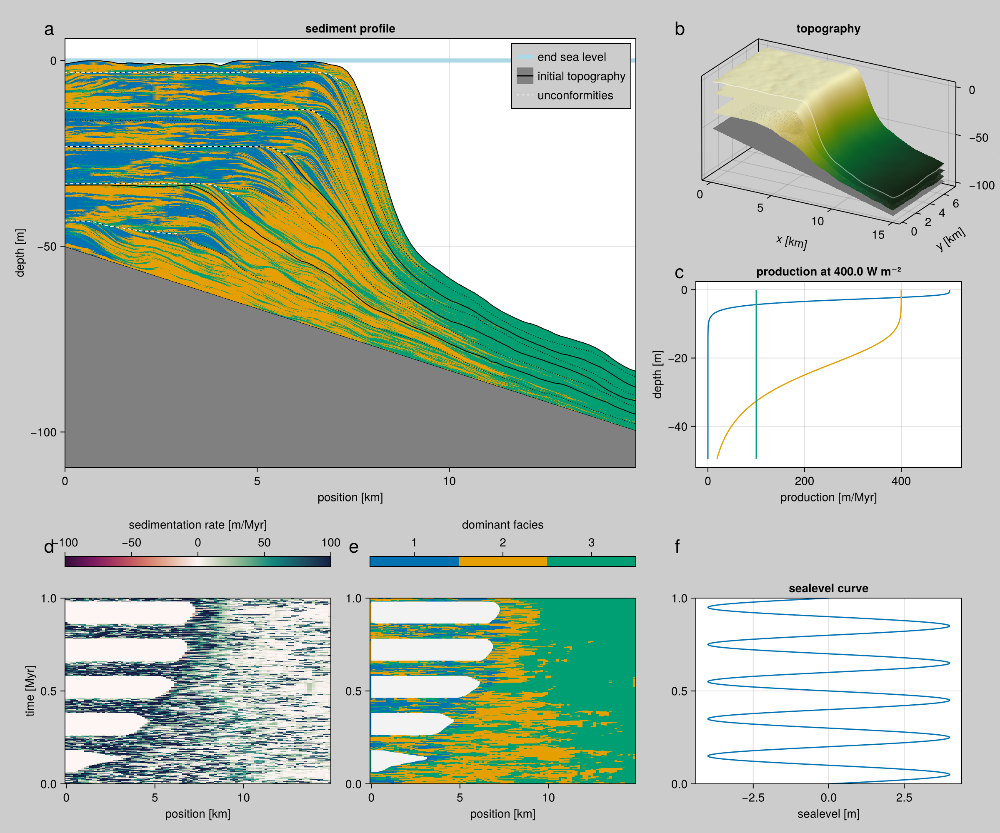
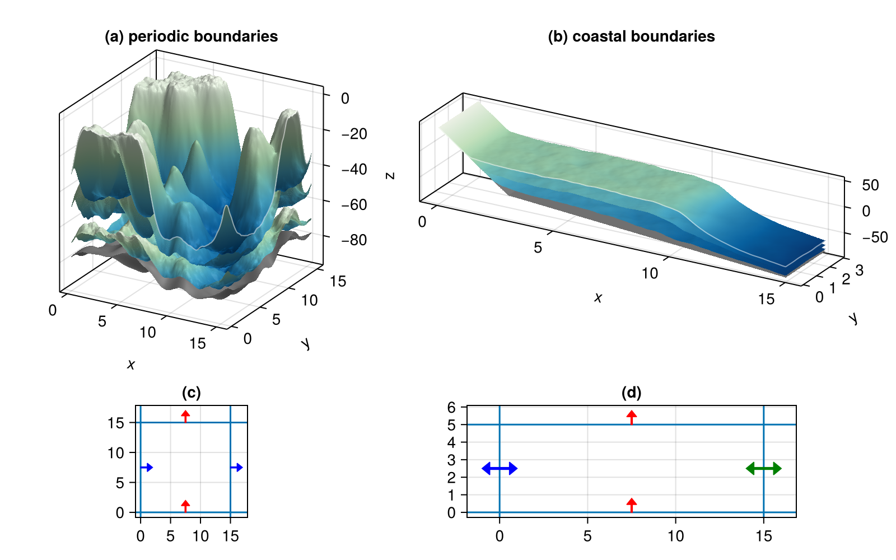
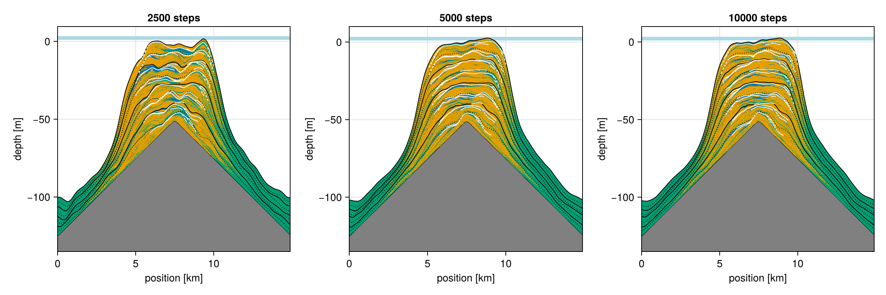
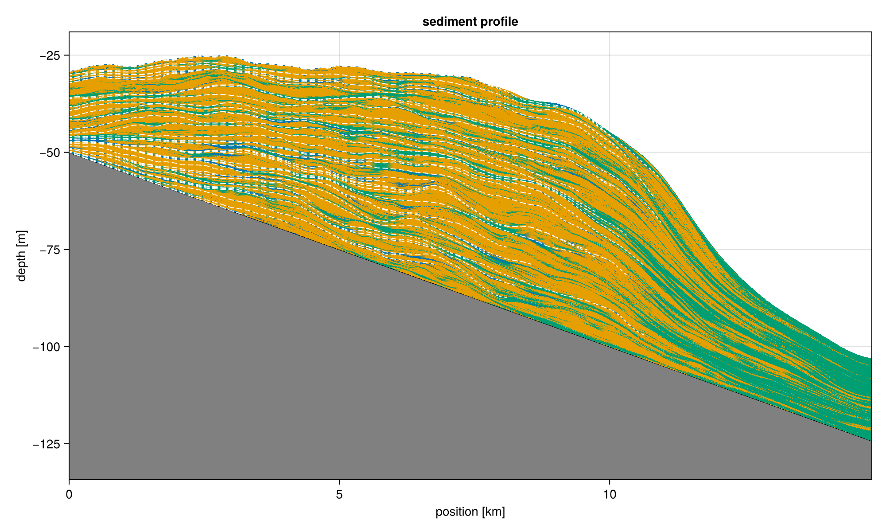
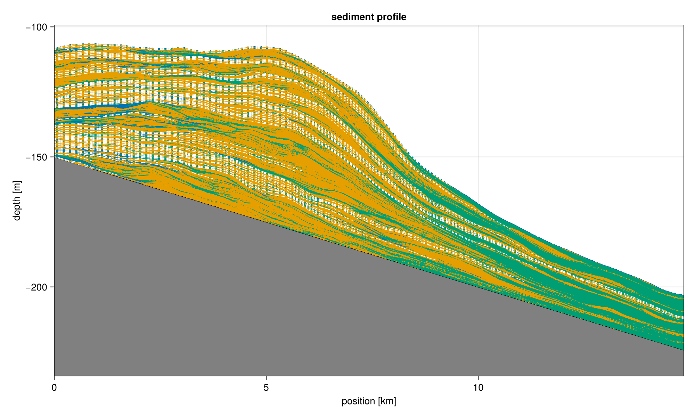
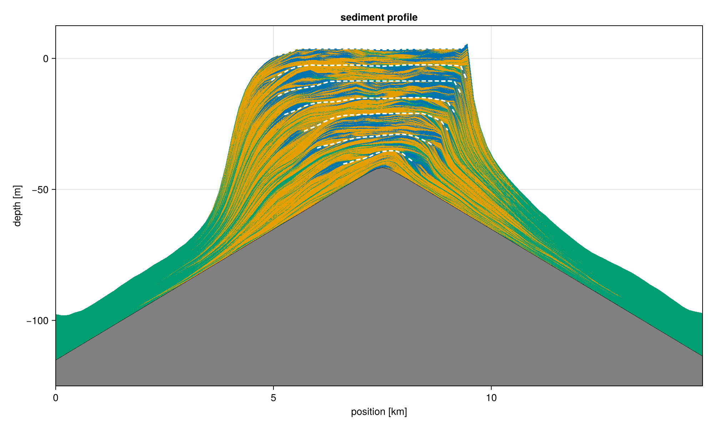
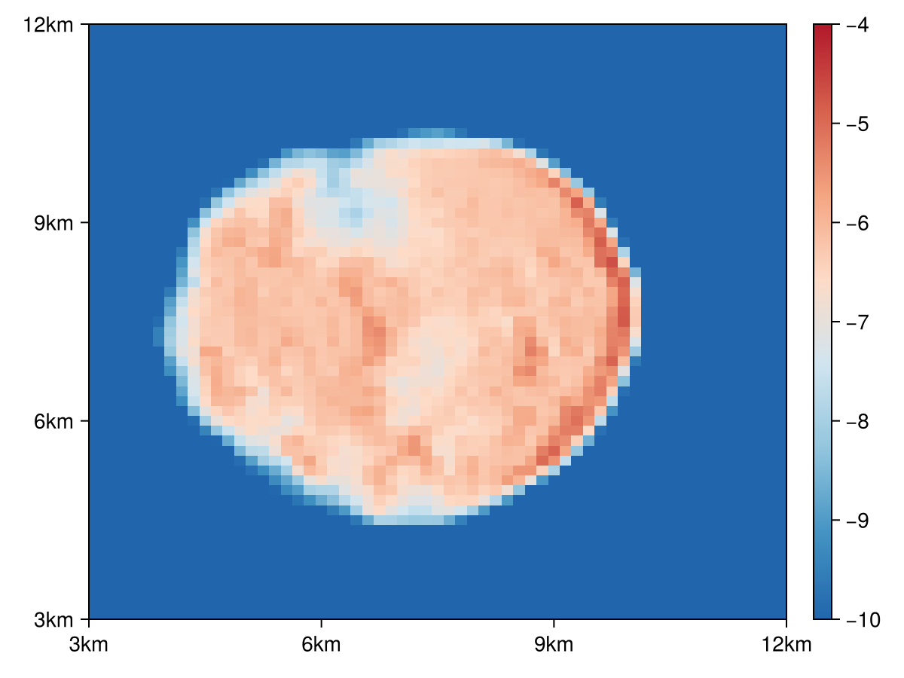

\newcommand{\term}[1]{\left(\frac{\partial \eta}{\partial t}\right)_{\textrm{#1}}}
\renewcommand{\[}{\begin{equation}}
\renewcommand{\]}{\end{equation}}

::: abstract
Abstract of this paper.
:::

# Introduction

Stratigraphic forward modelling is well established as a means of examining our understanding of the formation of stratal architectures (@burgess_numerical_2001, @paterson_accommodation_2006, @schlager_record_2009, @ding_quantitative_2019, @jean_borgomano_quantitative_2020, @liu_formation_2022), prediction, correlation and imputation of architectures from incomplete data (@Warrlich2008, masiero_syn-rift_2021), and testing hypotheses on the structure of the geological record (e.g., @kemp_stratigraphic_2018, @masiero_numerical_2020, @liu_estimating_2021) and the preservation of proxies (@curtis_natural_2025), fossils (@holland_quality_2000, @hannisdal_phenotypic_2006, @hohmann_identification_2024), or forcing mechanisms (@kemp_investigating_2016, @kemp_metre-scale_2019, @burgess_big_2019). Owing to their economic interest, most such models are proprietary to exploration companies and their availability to researchers is limited. Some older models developed by researchers share the fate of many other research software packages and their maintenance ceases, e.g. when a project ends (@Warrlich2000). It is not always possible to resuscitate such models, especially if documentation or license are lacking or code has not been shared (e.g., strobel_interactive_1989, @demicco_cycopath_1998, @barrett_reef_2017). As a result, the choice of stratigraphic forward models available to researchers at the moment is narrow and shifted towards siliciclastic (@hutton_sedflux_2008, @sylvester_stratigraphy_2024) or specifically fluvial depositional systems (@wild_sedsim_2019, @falivene_three-dimensional_2019), to the point that researchers may resort to these models to create simulations of carbonate sections (@zimmt_recognizing_2021).

Modeling carbonate depositional systems requires not only accounting for water and atmospheric processes, but also for the biological character of sediment production and dispersal. Ecological processes, such as facilitation, competition and dispersal, may on one hand confound the relationships between sediment composition and water depth (e.g. @granjeon_concepts_1999, @dyer_quantifying_2018, @weij_limited_2019) and, on the other hand, lead to creation of complex facies patterns under stable sea level conditions (@drummond_self-organizing_1999, @purkis_spatial_2016, @xi_stratigraphic_2022). Complex models accounting for it have been mostly developed for exploration, e.g. `Carbonate 3D` (@warrlich_quantifying_2002, @Warrlich2008), `DIONISOS` (@granjeon_concepts_1999) and `Carbonate GPM` (@hill_modeling_2009). Of research-driven models operating in more than one dimension, two include a wider range of depositional environment with carbonate production modules: `CARB3D+` (@paterson_accommodation_2006), `SedSimple` (@tetzlaff_stratigraphic_2023) and `Badlands` (@salles_badlands_2016), including its Python interface `pyBadlands` (@salles_pybadlands_2018), but due to their general focus these models do not account for the spatial heterogeneity driven by biological processes. Finally, `CarboCAT` (@Burgess2013) is a research-driven 2D model dedicated to stratigraphic forward modeling of carbonate platforms, which includes a cellular automaton that approximates the spatial heterogeneity formed through ecological interactions between carbonate-producing organisms. `CarboCAT` has been used in multiple studies (e.g. @masiero_numerical_2020, @xi_stratigraphic_2022, @hohmann_identification_2024), but having been written in Matlab, it was not accessible to contributions from the entire scientific community. Based on the successful applications of `CarboCAT`, we set out to develop a new generation model with the following specifications:

1.  it should be Open Source and it should be easy for researchers to understand the algorithm, which is a prerequisite to being able to contribute to it or modify it to one's needs,

2.  it should allow for spatial heterogeneity of carbonate facies,

3.  it should include a sediment transport algorithm operating on different carbonate facies and produces realistic results without decreasing the model's performance substantially,

4.  it should allow exporting and plotting multiple types of data users may need, including slices through the model grid, age-depth models, sediment accumulation curves, and stratigraphic columns,

5.  it should be performant, easy to parallelize, and platform-independent,

6.  it should be well documented and easy to use at a level accessible to a geosciences student.

The above prerequisites led us to re-designing the original architecture of `CarboCAT` and implementing its successor in Julia. In this article we present CarboKitten, an efficient and accessible Open Source model for stratigraphic forward simulations of tropical carbonate platforms.

# Model

CarboKitten combines the carbonate production model by @Bosscher1992, the cellular automaton from @Burgess2013, and a custom finite difference transport model inspired on an approach by @Paola1992. We describe each of these components in detail in the following sections.

## Quantities
Since the model describes the accumulation of sediment under a range of variable conditions, a short discussion of different measures in the vertical column is in order.

Subsidence rate

:   Quantified as a rate $\sigma$ in units of $\unit{m/Myr}$. The growth of sediment is only sustainable in scenarios where there is a steady subsidence. In our models we use a default value of $50\ \unit{m/Myr}$ (or $0.5\ \unit{mm/kyr}$). This parameter can be set by the users.

Initial topography

:   The model starts at an initial topography $\eta_0(x) = \eta(x, t_0)$, consisting of impenetrable bedrock. A more complex topography can be provided as an input array, e.g. by running a previous model and extracting the height of sediment.

Topography

:   The present topography $\eta(x, t)$ is given as the initial topgraphy plus any amount of sediment accumulated over time. In our definition of $\eta$ we don't correct for subsidence (see also the definition for water depth below).

Relative sea level

:   The relative sea level $R(t)$ is usually a function of time, given as an input parameter of the model.

Water depth

:   The water depth is computed from the current topography, relative sea level and subsidence rate,

$$w(x, t) = R(t) - \eta(x, t) + \int_{t_0}^{t} \sigma \textrm{d}t.$$

## Carbonate Production {#sec:carbonate-production}

The general form of our production model follows that of @Bosscher1992 (BS92). This model finds the sediment accumulation curve by integrating an ODE that outside of the model parameters only depends on the initial topography.

$$\frac{\partial \eta}{\partial t} = P(\eta),$$

where $P$ is the sediment production in $\textrm{m/Myr}$,

$$P(w) = g_m \tanh\left(\frac{I_0 e^{-kw}}{I_k}\right),$$

where $I_0$ is the insolation, $I_k$ is the saturation intensity, $k$ the extinction coefficient and $g_m$ the maximum growth rate.

This model encapsulates both the exponential extinction of sun light as water depth increases, and the idea that the growth of organisms interpolates between no growth at great depth and saturated growth in shallow waters (i.e. solar input is not the limiting factor at those depths).

Here we parametrize $P$ as a function of $w$. Note that $\nabla w = - \nabla \eta$, but otherwise we'll use $w$ and $\eta$ wherever one or the other is more convenient.

Following @Burgess2013, we extend the BS92 model by introducing multiple facies that each have their own growth characteristics (except for insolation $I_0$, which is a global input variable).

$$P(w) = \sum_f P_f(w)$$

| Factory | $g_m$ $[\unit{m/Myr}]$ | $I_k$ $[\unit{W/m^2}]$ | $k$ $[\unit{m^{-1}}]$ |
|----|----|----|----|
| Tropical | 500.0 | 60.0 | 0.8 |
| Mounds | 400.0 | 60.0 | 0.1 |
| Cool water | 100.0 | 60.0 | 0.005 |

: Parameters for the production model of the three default carbonate factories. {#tbl:factories}

Our default parameters define three biological facies based on sediment produced by three carbonate factories: the tropical (T), mounds (M) and cool water (C) factories. The default values for these factories are shown in Table @tbl:factories, and the resulting production curves shown in Figure @fig:factories.

{#fig:factories width="8.3cm"}

::: hide
``` julia
#| id: bs92-input
const FACIES = [
    BS92.Facies(
         maximum_growth_rate=500u"m/Myr"/4,
         extinction_coefficient=0.8u"m^-1",
         saturation_intensity=60u"W/m^2"),
    BS92.Facies(
         maximum_growth_rate=400u"m/Myr"/4,
         extinction_coefficient=0.1u"m^-1",
         saturation_intensity=60u"W/m^2"),
    BS92.Facies(
         maximum_growth_rate=100u"m/Myr"/4,
         extinction_coefficient=0.005u"m^-1",
         saturation_intensity=60u"W/m^2")]

const INPUT = BS92.Input(
    tag = "example model BS92",
    box = CarboKitten.Box{Coast}(grid_size=(100, 1), phys_scale=150.0u"m"),
    time = TimeProperties(
        Δt = 200.0u"yr",
        steps = 5000),
    sea_level = t -> 4.0u"m" * sin(2π * t / 0.2u"Myr"),
    initial_topography = (x, y) -> - x / 300.0,
    subsidence_rate = 50.0u"m/Myr",
    insolation = 400.0u"W/m^2",
    facies = FACIES)
```

``` julia
#| classes: ["task"]
#| creates: ["md/fig/production-curves.pdf"]
#| collect: figures

module Script
using CairoMakie
using CarboKitten
using CarboKitten.Visualization: production_curve!

<<bs92-input>>

inch = 96
pt = 4/3
cm = inch / 2.54

function main()
  fig = Figure(size=(8.3cm, 9.0cm), fontsize=8pt)
  ax = Axis(fig[1, 1])
  production_curve!(ax, INPUT)
  ax.scene.plots[1].label = "tropical"
  ax.scene.plots[2].label = "mounds"
  ax.scene.plots[3].label = "cool water"
  axislegend(ax, "facies", valign = :bottom)
  save("md/fig/production-curves.pdf", fig)
end

end

Script.main()
```
:::

## Cellular Automaton

The Celullar Automaton (CA) in CarboKitten is a direct reimplementation of the one described by @Burgess2013 in their package CarboCAT.

The CA emulates the biological succession of species by following a set of simple rules. If conditions are right, a species will multiply and occupy neighbouring territory. However, when there are too many of the same kind, the species will die from over population.

For each cell in the grid a centered neighbourhood of $5\times 5$ pixels is considered. We count the number of neighbouring cells of the same species. Then we consider two ranges: the *activation range* (default $6 \le n \le 10$) and *viability range* (default $4 \le n \le 10$). If the number of live neighbours is in the viability range, the cell stays alive. If the cell was dead, but the number of live neighbours is in the activation range, the cell becomes alive.

Since a dead cell may qualify to become alive for different carbonate factories at the same time, birth priority is rotated every iteration.

In the default configuration we emulate three species, corresponding to the Tropical, Mound and Cool water species discussed in the section on carbonate production. The state of the CA determines which carbonate factory is switched on for each cell in the grid.

::: hide
``` julia
#| classes: ["task"]
#| creates: ["md/fig/ca-first-steps.pdf"]
#| collect: figures

module Script
using CarboKitten
using CarboKitten.Components: CellularAutomaton as CA
using CairoMakie

function main()
  input = CA.Input(
      box = CarboKitten.Box{Periodic{2}}(
        grid_size=(50, 50), phys_scale=1.0u"m"),
      facies = fill(CA.Facies(), 3)
  )

  state = CA.initial_state(input)
  step! = CA.step!(input)
  
  fig = Figure(size=(1000, 500))
  axes_indices = Iterators.flatten(eachrow(CartesianIndices((2, 4))))
  xaxis, yaxis = box_axes(input.box)
  for (i, idx) in enumerate(axes_indices)
    ax = Axis(fig[Tuple(idx)...], aspect=AxisAspect(1), title="step $(i)")
    if idx[1] == 2
      ax.xlabel = "x [m]"
    end
    if idx[2] == 1
      ax.ylabel = "y [m]"
    end
    heatmap!(ax, xaxis/u"m", yaxis/u"m", state.ca)
    step!(state)
  end
  save("md/fig/ca-first-steps.pdf", fig)
end

end

Script.main()
```

``` julia
#| classes: ["task"]
#| creates: ["md/fig/ca-long-term.png"]
#| collect: figures
module Script
using CarboKitten
using CarboKitten.Components: CellularAutomaton as CA
using CairoMakie

function main()
  input = CA.Input(
      box = CarboKitten.Box{Periodic{2}}(
        grid_size=(50, 50), phys_scale=1.0u"m"),
      facies = fill(CA.Facies(), 3)
  )

  state = CA.initial_state(input)
  step! = CA.step!(input)

  for _ in 1:1000
    step!(state)
  end
  
  fig = Figure(size=(1000, 500))
  axes_indices = Iterators.flatten(eachrow(CartesianIndices((2, 4))))
  xaxis, yaxis = box_axes(input.box)
  i = 1000
  for row in 1:2
    for col in 1:4
      ax = Axis(fig[row, col], aspect=AxisAspect(1), title="step $(i)")
      
      if row == 2
        ax.xlabel = "x [m]"
      end
      if col == 1
        ax.ylabel = "y [m]"
      end

      heatmap!(ax, xaxis/u"m", yaxis/u"m", state.ca)
      step!(state)
      i += 1
    end
    for _ in 1:996
      step!(state)
      i += 1
    end
  end
  save("md/fig/ca-long-term.pdf", fig)
end

end

Script.main()
```
:::

{.wide}

Figure: Iterations of the CA, as described by @Burgess2013, on a periodic grid of $50\times50$. Starting with random noise, we first iterate 1000 times to get into a typical state. The top row shows iterations 1000 to 1003, the bottom row 2000 to 2003. This shows that the patterns keep reasonably stable on the short term, while evolving more extensively over the long term. {#fig:ca}

## Transport

Our transport model is borrowed from other similar approaches in siliclastic (river bed) modeling [See @Paola1992; @James2010], where it is made plausible that this approach is viable for models that work on long time scales. Because our transport model is novel (at least for modelling carbonate platforms), we discuss the full model in a separate section. Here, we discuss how transport is embedded in the larger model.

We consider all sediment transport to happen in an **active layer** close to the sea floor. This layer has a certain concentration of sediment $C_f$ that travels along a path of steepest descent. We say that this material is **entrained**. Every time step the active layer is fed with freshly produced sediment and distintegrated older sediment. After transport a fraction of the entrained sediment is deposited on the sea floor in process that we refer to as **cementation**, see Figure @fig:active-layer-diagram. In reality, cementation is the process of sediment stabilization and is the first step of lithification, i.e. the process of turning sediment into a rock. As a result of cementation, grains are connected with each other by growing crystals and cannot be entrained easily.


Figure: Diagram showing concepts of production, cementation and disintegration. Every time step newly produced sediment and older disintegrated material (configured as a disintegration rate) is added to the active layer. After transport, a set fraction of the sediment (configured as a cementation half-life time) is cemented onto the sea floor. {#fig:active-layer-diagram}

The actual transport is computed using a finite difference approach that is further discussed in Section @sec:transport.

## Composed model

Putting everything together, we evaluate the model as follows each iteration:

1.  Advance the cellular automaton.
2.  Compute the production $P_f$.
3.  Disintegrate sediment $D_f$.
4.  Transport entrained sediment $C_f$.
5.  Deposit cemented sediment.

Advancing the CA can be configured to happen one-in-$n$ iterations to slow it down. Transporting the sediment can be computed on smaller time steps if required for numeric stability.

## Input parameters

CarboKitten has many input parameters: box geometry, time parameters, a list of facies properties, transport model intrinsics and external conditions: initial topography, relative sea level and insolation. We've already discussed the facies properties in Section @sec:carbonate-production, and the transport model is discussed in Section @sec:transport. That leaves us the external conditions that should be considered the driving forces of carbonate platform formation.

The initial topography, sea level and insolation can all be entered in three different ways: a given constant, a Julia function or an array exactly matching the box size or number of time steps.

In Section @sec:examples We provide two examples where we use external sources to drive the sea level and insolation curves.
A full list  of input parameters is available in the Appendix.

## Visualisations

CarboKitten generates data in the accessible, binary HDF5 format, thus output can be visualised with most common tools, e.g. imported into R or a Jupyter notebook. Nevertheless, we provide some routines based on Makie [@DanischKrumbiegel2021] for creating crosssections, Wheeler diagrams and topographic overviews. Some of the most common plot types have been collected into a summary plot, which is shown in Figure @fig:summary-plot.

{.wide}

Figure: Overview of different visualizations supported by CarboKitten. Panel (a) shows a stratigraphic crosssection, including an indication for unconformities, (b) a topographic overview including two intermediate time steps, (c) the production curves used, (d) sedimentation rate as a function of time (Wheeler diagram), (e) dominant facies as a function of time, (f) the sea-level curve given as input. The combined plot is arranged such that spatial data is on the top row, while time-dependent information is shown at the bottom with matching y-axes. {#fig:summary-plot}

:::hide
```julia
#| file: runs/standard_example_run.jl
#| classes: ["task"]
#| creates: data/alcap-example.h5
module StandardExample
using CarboKitten
using CarboKitten.Models: ALCAP as M

function main()
    CarboKitten.init()
    run_model(Model{M}, M.Example.INPUT, "data/alcap-example.h5")
end
end

StandardExample.main()
```

```julia
#| file: runs/standard_example_plot.jl
#| classes: ["task"]
#| requires: data/alcap-example.h5
#| creates: md/fig/summary-plot.png
#| collect: figures
module StandardExamplePlot
using CairoMakie
using CarboKitten.Visualization: summary_plot

function add_panel_labels!(fig::Figure; 
                          labels::Vector{String}, 
                          fontsize::Int64,
                          offset1::Tuple{Int64, Int64},
                          offset2::Tuple{Int64, Int64})

    panel_positions = [
        (1, 1), # a 
        (1, 3), # b 
        (2, 3), # c 
        (3, 1), # d 
        (3, 2), # e 
        (3, 3)  # f 
    ]

    for (i, (row, col)) in enumerate(panel_positions)
        if i <= 3   
            Label(fig[row, col], labels[i], 
                  tellwidth=false, 
                  tellheight=false,
                  halign=:left,
                  valign=:top,
                  padding=(offset1[1], offset1[1], -offset1[2], offset1[1]),
                  fontsize=fontsize)
        else 
            Label(fig[row, col], labels[i], 
                    tellwidth=false, 
                    tellheight=false,
                    halign=:left,
                    valign=:top,
                    padding=(offset2[1], offset2[1], -offset2[2], offset2[1]),
                    fontsize=fontsize)
        end
    end

    return fig
end


function main()
    fig = summary_plot("data/alcap-example.h5")
    add_panel_labels!(fig, labels = ["a", "b", "c", "d", "e", "f"], fontsize = 22, offset1 = (-25,-5), offset2 = (-25,10))
    save("md/fig/summary-plot.png", fig)
end
end

StandardExamplePlot.main()
```
:::


# Transport {#sec:transport}
Our transport model supposes that all entrained sediment resides in a layer of constant thickness just above the sea floor, also known as the **active layer**. The concentration of sediment $C_f$ is considered separately for each facies (as with all quantities with the $f$ subscript)..

Following @Paola1992, we assume a local sediment flux proportional to the local gradient,

$$\vec{q}_f = - C_f (d_f \vec{\nabla} \eta + \vec{v}_f(w)),$$

where $d_f$ is a facies dependent diffusivity, and $v_f(w)$ is a chosen additional velocity as a function of water depth. Optionally, we use $v_f(w)$ to model wave induced sediment transport. The mass balance is then,

$$\left(\frac{\partial \eta}{\partial t}\right)_{\textrm{transport}} = -\sum_f \vec{\nabla} \cdot \vec{q}_f$$

This gives us a diffusion equation in $\eta$, but we can also view it as an advection equation for the sediment concentraiton $C_f$. We also express everything in terms of water depth, having $\nabla w = -\nabla \eta$, arriving at

$$
\frac{\partial C_f}{\partial t} = -(d_f \vec{\nabla} w + \vec{v}_f(w)) \cdot \vec{\nabla}C +
(\vec{s}_f(w) \cdot \vec{\nabla} w - d_f \nabla^2 w) C,
$${#eq:transport}

where $\vec{s}_f(w) = \vec{v}_f'(w)$ is the velocity shear, or the derivative of the velocity with respect to water depth. We solve this PDE using a finite difference method-of-lines approach with an explicit solver (forward Euler and $4^{th}$ order Runge-Kuta are supported).

## Other approaches
In the critical angle approach developed by @Warrlich2000, sediment is transported from unstable slopes to the nearest down-slope stable region. Stability is defined separately for different grain sizes. This method is motivated by the empirical relationship between grain composition and maximum slope angle [@Kenter1990].

The problem with this critical angle-based method of transport is that production across an unstable region is deposited on a small strip, where slopes are below the critical angle. It becomes unclear how to interpret these models from a physics point of view, as results depend heavily on the time-step that is chosen. 

One aspect of critical angle theory that we do use is that we can modulate the disintegration rate (and therefore the amount of entrained material) with the magnitude of the slope $|\nabla \eta|$. If we only disintegrate material where the slope is supercritical, the net effect is that sediment is transported from supercritical to stable areas. The difference is that we have a much better control over the physics, and we don't need to convert back and forth between gridded values and a particle representation used in the critical angle approach [e.g. @Warrlich2000].

A different approach has been used in the early model `CARBPLAT` by @bosscher_carbplatcomputer_1992, which took empirically observed carbonate slopes (such as started by @Kenter1990 and studied by others, including @adams_basic_2000) and defined a slope function that returned slope parameters bounded by the limits of the angle of repose. In this study an exponential slope function was assumed, although it should be noted that there is literature debate on the distribution of slope shapes of carbonate platforms (e.g., @schlager_submarine_1986, @Kenter1990, @adams_basic_2000). This modelling approach is agnostic with respect to sediment properties and transport mechanisms and optimises the similarity to observed shapes, allowing the user to choose the parameter that produces the best result. However, it does not allow modelling a mixture of sediment types with different properties and requires an a priori assumption on the expected slope shape. It had not been adapted in subsequent models.

## Wave-induced transport

We model the transport by waves by setting the velocity $v_f$ and shear $s_f$ components in the transport Equation @eq:transport. Considering the long timescales we are working with, we limit ourselves to a highly simplified model, with the goal of achieving an effect comparable with that of wave-induced transport. Given the timescales for which the model is developed, with time steps of the order of $100$ years, a more physical representation of wave-induced transport is not possible. By necessity, the result imitates the time-averaged effect of tranport.

Our approach is illustrated with an example of an atoll, starting with a conical topography, periodic boundaries and a sediment transport vector with a constant depth profile. We follow @xi_stratigraphic_2022, who use the following equation for the phase velocity of waves as a function of depth:

$$v(w) = \sqrt{\frac{\lambda g}k} {\rm tanh} (k w),$$

where $w$ is the water depth, $k$ the wave number ($k = 2\pi / \lambda$), and $g$ is the gravitational acceleration. This velocity is the phase-velocity of surface waves, given the total depth of the water. To evaluate the transport velocity at deeper levels, we  multiply the phase velocity with a factor $\exp(-kw)$ to account for Stokes drift:

$$v_f = A_f \exp (- k w) \tanh (k w),$$

where $A_f$ the facies-dependent maximum transport velocity. The $k$ parameter can be tweaked to set the depth at which the maximum transport velocity is attained. We assume most of the sediment transport happens close to the sea floor. This profile is chosen for its assymptotic properties: at high water depth the transport velocity converges to zero, while the decrease in wave velocity towards shallow depths ensures that there is a net influx of material close to the shore. An example of this profile is shown in Figure @fig:wave-transport-magnitude.


Figure: Depth profile of wave velocity and shear. The velocity profile was taylored to have a maximum of $10\ \unit{m/yr}$ at a depth of $20\ \unit{m}$. Where the shear is negative (assuming transport is directed onshore), there is a net accumulation of sediment. {#fig:wave-transport-magnitude}

::: hide
``` julia
#| id: velocity-profile
v_prof(v_max, max_depth, w) = 
    let k = sqrt(0.5) / max_depth,
        A = 3.331 * v_max,
        α = tanh(k * w),
        β = exp(-k * w)
        (A * α * β, -A * k * β * (1 - α - α^2))
    end
```

``` julia
#| classes: ["task"]
#| creates: md/fig/wave-transport-magnitude.pdf
#| collect: figures

module Script

using CairoMakie
using Unitful

<<velocity-profile>>

inch = 96
pt = 4/3
cm = inch / 2.54

function main()
    w = LinRange(0, 100.0, 1000)u"m"
    f = v_prof.(10.0u"m/yr", 20.0u"m", w)

    v = first.(f)
    s = last.(f)
    
    fig = Figure(size=(8.3cm, 6cm), fontsize=8pt)
    ax1 = Axis(fig[1, 1], title="transport velocity", yreversed=true, xlabel="velocity [m/yr]", ylabel="depth [m]")
    ax2 = Axis(fig[1, 2], title="transport shear", yreversed=true, xlabel="shear [1/yr]", ylabel="depth [m]")
    lines!(ax1, v / u"m/yr", w / u"m")
    lines!(ax2, s / u"1/yr", w / u"m")
    save("md/fig/wave-transport-magnitude.pdf", fig)
end

end

Script.main()
```
:::

## Parameter choices

Our transport model is based on the elementary assumption that sediment flux is proportional to the slope of the sea floor. Nevertheless, we are extrapolating this idea to time scales on which it is hard to reason or otherwise measure the parameters to our model. Especially the combination of diffusivity, disintegration rate and cementation time can be pivotal in acquiring a set of physical outcomes, while we have no good way to estimate acceptable ranges of values for them, other than trying them out and see if the results are plausible.

### Disintegration versus cementation
Both the disintegration rate and the cementation time modulate how long sediment resides in the active layer. By carefully scaling one or the other, the effective diffusion of material can be controlled without changing the specific diffusivity. However, choosing a high cementation time (thus a slow cementation) over a high disintegration rate can help in transporting only freshly produced sediments.

Note that not setting the cementation rate (which would amount to immediately cementing all of the active layer on every iteration) results in models that depend heavily on a chosen time step. 

{.wide}

Figure: Comparison between cementation and disintegration. The four panes show different combinations of parameters for a one-dimensional model. We have enabled a production of $100\ \unit{m/Myr}$ for a $4\ \unit{km}$ wide patch in the middle of the box, and chose a runtime of $1\ \unit{Myr}$ with a time step of $100\ \unit{yr}$ (the sharp edges in the production profile induce fast transport, requiring small time steps).
Panels $(a)$ and $(b)$ have a short cementation time `ct` ($100\ \unit{yr}$), while panels $(c)$ and $(d)$ have a long cementation time ($1000\ \unit{yr}$). On the columns, $(a)$ and $(c)$ have a low disintegration rate `dr` ($10\ \unit{m/Myr}$), while $(b)$ and $(d)$ have a high disintegration rate ($500\ \unit{m/Myr}$). Values were chosen to have a similar net effect on the dispersion of produced sediment. {#fig:disintegration-vs-cementation}

:::hide
```julia
#| file: runs/ParameterScan.jl
module ParameterScan

function cartesian_product(; pars...)
    ks = keys(pars)
    vs = Iterators.product(values(pars)...)
    collect(ks .=> v for v in vs)
end

kwsplat(f) = d -> f(;d...)

end
```

```julia
#| file: runs/TransportPlots.jl
module TransportPlots

using CarboKitten
using CairoMakie
using Unitful
using Printf

function plot_topography(result)
    fig = Figure()
    ax = Axis(fig[1, 1])
    plot_topography!(ax, result)
    fig
end

function plot_topography!(ax, result)
    diffusivity::typeof(1.0u"m/yr") = result.header.attributes[:diffusivity]
    disintegration_rate::typeof(1.0u"m/Myr") = result.header.attributes[:disintegration_rate]

    dt = result.header.Δt

    ax.xlabel = "x [km]"
    ax.ylabel = "h [m]"

    h0 = result.header.initial_topography[:,1]
    x_axis = result.header.axes.x |> in_units_of(u"km")
    slice = result.data_volumes[:all][:, 1]
    t_axis = result.header.axes.t[1:slice.write_interval:end] |> in_units_of(u"Myr")
    time_steps = div(result.header.time_steps, slice.write_interval)

    ixs = [div(time_steps, 10) + 1, div(time_steps, 2) + 1, time_steps]
    for ix in ixs
        h = (h0 .+ slice.sediment_thickness[:, ix]) |> in_units_of(u"m")
        lines!(ax, x_axis, h, label=@sprintf("%.1f", t_axis[ix]))
    end
end

function plot_matrix(plot!, results, row_names, col_names; fig_pars...)
    fig = Figure(;fig_pars...)
    nrows, ncols = size(results)
    @assert nrows == length(row_names)
    @assert ncols == length(col_names)

    for (i, c) in enumerate(col_names)
        Label(fig[i, 0], c, rotation = pi/2, tellheight=false, tellwidth=true)
    end
    for (i, r) in enumerate(row_names)
        Label(fig[0, i], r, tellheight=true, tellwidth=false)
    end
    axes = [Axis(fig[reverse(Tuple(i))...], title="($('`'+l))")
        for (l,i) in enumerate(eachindex(IndexCartesian(), results))]

    for i in eachindex(IndexCartesian(), results)
        ax = axes[i]
        if i != CartesianIndex(1, 1)
            linkyaxes!(axes[1, 1], ax)
        end
        plot!(ax, results[i])
        if i[2] != ncols
            ax.xlabel = ""
        end
        if i[1] != 1
            ax.ylabel = ""
        end
    end

    Legend(fig[:, nrows+1], axes[1, 1], "time steps [Myr]")

    return fig
end

end
```

```julia
#| file: runs/CustomProductionModel.jl
using CarboKitten
using CarboKitten.Components.Common
using CarboKitten.Components:
    TimeIntegration, Boxes, FaciesBase, SedimentBuffer, WaterDepth, 
    Tag, ActiveLayer, H5Writer
using ModuleMixins

@compose module CustomProduction
@mixin Tag, ActiveLayer, H5Writer

@kwdef struct Input <: AbstractInput
    production    # a function of (x, y, wd)
end

function initial_state(input::AbstractInput)
    sediment_height = zeros(Height, input.box.grid_size...)
    sediment_buffer = zeros(Float64, input.sediment_buffer_size, n_facies(input), input.box.grid_size...)
    active_layer = zeros(Amount, n_facies(input), input.box.grid_size...)

    state = State(
        step=0, sediment_height=sediment_height,
        sediment_buffer=sediment_buffer,
        active_layer = active_layer)

    return state
end

function step!(input::Input)
    disintegrate! = ActiveLayer.disintegrator(input)
    transport! = ActiveLayer.transporter(input)
    local_water_depth = water_depth(input)
    x, y = box_axes(input.box)
    na = [CartesianIndex()]
    produce(_, wd) = input.production.(x[:,na], y[na,:], wd)[na,:,:]
    pf = cementation_factor(input)

    function (state::State)
        wd = local_water_depth(state)
        p = produce(state, wd)
        d = disintegrate!(state)

        state.active_layer .+= p
        state.active_layer .+= d
        transport!(state)

        deposit = pf .* state.active_layer
        push_sediment!(state.sediment_buffer, deposit ./ input.depositional_resolution .|> NoUnits)
        state.active_layer .-= deposit
        state.sediment_height .+= sum(deposit; dims=1)[1,:,:]
        state.step += 1

        return Frame(
            production = p,
            disintegration = d,
            deposition = deposit)
    end
end

end
```

```julia
#| file: runs/TransportTest.jl
module TransportTest

include("CustomProductionModel.jl")

using CarboKitten
using CairoMakie
using CarboKitten: Box
using CarboKitten.OutputData: set_attribute
using .CustomProduction: CustomProduction as M

const Time = typeof(1.0u"Myr")

function run_with(;dt, diffusivity, disintegration_rate, cementation_time, patch_width = 2.0u"km")
    facies = [
        M.Facies(
            diffusion_coefficient=diffusivity)  # 10u"m/yr"
    ]

    box = Box{Periodic{2}}(
        grid_size=(500, 1), phys_scale=30.0u"m")

    t_end = 1.0u"Myr"
    time = TimeProperties(
        Δt = dt,
        steps = (t_end / dt) |> round |> Int)

    @info "Running at Δt = $(time.Δt) and steps = $(time.steps)"
    @info "Production in a single step: $(100.0u"m/Myr" * time.Δt)"


    centre = box.grid_size[1] * box.phys_scale / 2.0
    production(x, y, w) = abs(x - centre) < patch_width ?
        100.0u"m/Myr" * time.Δt :
        0.0u"m"

    write_interval = div(time.steps, 100)

    input = M.Input(
        box=box,
        time=time,
        output = Dict(
            :all => OutputSpec(write_interval=write_interval)),
        initial_topography=(_, _) -> -100.0u"m",
        sea_level=t -> 0.0u"m",
        subsidence_rate=0.0u"m/Myr",
        disintegration_rate=disintegration_rate,
        sediment_buffer_size=50,
        depositional_resolution=0.5u"m",
        cementation_time=cementation_time,
        transport_solver=Val{:forward_euler},
        facies=facies,

        production=production)

    result = run_model(Model{M}, input, MemoryOutput(input))
    set_attribute(result, :diffusivity, diffusivity)
    set_attribute(result, :disintegration_rate, disintegration_rate)
    return result
end

end
```

```julia
#| file: runs/disintegration-vs-cementation.jl
#| classes: ["task"]
#| creates:
#|   - md/fig/disintegration-vs-cementation.pdf
#| requires:
#|   - runs/TransportTest.jl
#|   - runs/TransportPlots.jl
#| collect: figures
module DisintegrationVsCementation

include("TransportPlots.jl")
include("ParameterScan.jl")
include("TransportTest.jl")

using CarboKitten
using CairoMakie
using .ParameterScan: cartesian_product
using .TransportTest: run_with
using .TransportPlots: plot_matrix, plot_topography!

function main()
    CarboKitten.init()

    pars = (
        diffusivity = [ 10.0 ] * u"m/yr",
        disintegration_rate = [ 10.0, 500.0 ] * u"m/Myr",
        dt = [ 100.0 ] * u"yr",
        cementation_time = [ 100.0, 1000.0 ] * u"yr" )
    cp = cartesian_product(;pars...)

    result = Array{Union{Missing, MemoryOutput}}(missing, size(cp)...)
    Threads.@threads for i in eachindex(cp)
        result[i] = run_with(;cp[i]...)
    end

    fig = plot_matrix(result[1,:,1,:], 
            ["dr = $(d.val) m/Myr" for d in pars.disintegration_rate],
            ["ct = $(d.val) yr" for d in pars.cementation_time];
            fontsize = 10) do ax, result
        plot_topography!(ax, result)
    end

    save("md/fig/disintegration-vs-cementation.pdf", fig)
end

end

DisintegrationVsCementation.main()
```
:::

### Disintegration rate

Expressing disintegration in terms of rates is a good parametrization choice if we consider the concentration of sediment and the fraction of old versus new sediment in it. However, dynamically speaking, if we consider the process of diffusing or eroding topographic features, it is more meaningful to talk about a disintegration depth. Looking at the shape of features we see changes with the time step.

### Cementation time

:::hide
```julia
#| file: runs/test-cementation.jl
```
:::

# Software design

## Box topology

:::hide

```julia
#| file: runs/topology_coast.jl
#| classes: ["task"]
#| creates: data/topology_coast.h5
module TopologyCoast

using CarboKitten
using CarboKitten.Models: ALCAP as M

function main()
    CarboKitten.init()

    facies = [
        M.Facies(
            maximum_growth_rate=500u"m/Myr",
            extinction_coefficient=0.8u"m^-1",
            saturation_intensity=60u"W/m^2",
            diffusion_coefficient=10.0u"m/yr"),
        M.Facies(
            maximum_growth_rate=400u"m/Myr",
            extinction_coefficient=0.1u"m^-1",
            saturation_intensity=60u"W/m^2",
            diffusion_coefficient=10.0u"m/yr"),
        M.Facies(
            maximum_growth_rate=100u"m/Myr",
            extinction_coefficient=0.005u"m^-1",
            saturation_intensity=60u"W/m^2",
            diffusion_coefficient=10.0u"m/yr")
    ]

    sea_level(t) =
        10.0u"m" * sin(2π * t / 123456.0u"yr") +
         5.0u"m" * sin(2π * t /  23456.0u"yr")

    kwargs = (
        sea_level = sea_level,
        subsidence_rate=50.0u"m/Myr",
        disintegration_rate=50.0u"m/Myr",
        insolation=400.0u"W/m^2",
        sediment_buffer_size=50,
        depositional_resolution=0.5u"m",
        transport_solver=Val{:forward_euler},
    )

    coast_input = M.Input(
        time = TimeProperties(
            Δt=0.0002u"Myr",
            steps=5000),
        box = Box{Coast}(
            grid_size=(250, 50), 
            phys_scale=60.0u"m"),
        facies = facies,
        initial_topography = (x, y) -> let x_prime = x - 3.0u"km"
            x_prime > 0.0u"km" ? - x_prime / 300.0 : - x_prime / 30.0
        end,
        output = Dict(
            :topography => OutputSpec(write_interval = 1000),
            :profile => OutputSpec(slice = (:, 25)));
        kwargs...)

    run_model(Model{M}, coast_input, "data/topology_coast.h5")
end

end

TopologyCoast.main()
```

```julia
#| file: runs/Noise.jl
module Noise
using FFTW

"""
    make_noise(box::Box, n, s, σ)

Make some Gaussian Random Noise with a power spectrum of

``P(k) = (s k)^n \\exp(-2 π^2 k^2 σ^2)``

The `box` should have periodic boundaries, `n` be a unitless
number (usually between -2.0 and 2.0), `s` is a scaling in meters
which only affects the amplitude and is needed to make `s * k` unitless,
and `σ` is the standard deviation of the Gaussian filter to reduce
small scale noise.

The noise is first generated as Gaussian white noise, then convolved in
Fourier space by multiplying with the square root of the power spectrum.

Example:

    box = Box{Periodic{2}}(grid_size=(100, 100), phys_scale=300.0u"m")
	cnoise = make_noise(box, -1.5, 50.0u"m", 500.0u"m")

"""
function make_noise(box, n, s, σ)
    white_noise = randn(box.grid_size...)
    P(k) = (k * s)^n * exp(-π^2 * k^2 * 2 * σ^2)
    kx = FFTW.rfftfreq(box.grid_size[1], 1/box.phys_scale)
    ky = FFTW.fftfreq(box.grid_size[2], 1/box.phys_scale)
    kabs = sqrt.(kx.^2 .+ ky'.^2)

    fy = FFTW.rfft(white_noise)
    p  = P.(kabs)
    p[1] = 0.0
    fy .*= sqrt.(p)
    FFTW.irfft(fy, box.grid_size[1])
end
end
```

```julia
#| file: runs/topology_periodic.jl
#| classes: ["task"]
#| creates:
#|   - data/topology_periodic.h5
#| requires:
#|   - runs/Noise.jl
include("Noise.jl")

module TopologyPeriodic

using CarboKitten
using CarboKitten.Models: ALCAP as M
using ..Noise: make_noise

function main()
    CarboKitten.init()

    facies = [
        M.Facies(
            maximum_growth_rate=500u"m/Myr",
            extinction_coefficient=0.8u"m^-1",
            saturation_intensity=60u"W/m^2",
            diffusion_coefficient=10.0u"m/yr"),
        M.Facies(
            maximum_growth_rate=400u"m/Myr",
            extinction_coefficient=0.1u"m^-1",
            saturation_intensity=60u"W/m^2",
            diffusion_coefficient=10.0u"m/yr"),
        M.Facies(
            maximum_growth_rate=100u"m/Myr",
            extinction_coefficient=0.005u"m^-1",
            saturation_intensity=60u"W/m^2",
            diffusion_coefficient=10.0u"m/yr")
    ]

    sea_level(t) =
        10.0u"m" * sin(2π * t / 123456.0u"yr") +
         5.0u"m" * sin(2π * t /  23456.0u"yr")

    kwargs = (
        sea_level = sea_level,
        subsidence_rate=50.0u"m/Myr",
        disintegration_rate=50.0u"m/Myr",
        insolation=400.0u"W/m^2",
        sediment_buffer_size=50,
        depositional_resolution=0.5u"m",
        transport_solver=Val{:forward_euler},
    )

    box = Box{Periodic{2}}(grid_size=(256, 256), phys_scale=60.0u"m")
    initial_topography = make_noise(box, -1.5, 5.0u"m", 1.0u"km") .* 1.0u"m" .- 30.0u"m"

    coast_input = M.Input(
        time = TimeProperties(
            Δt=0.0002u"Myr",
            steps=5000),
        box = box,
        facies = facies,
        initial_topography = initial_topography,
        output = Dict(
            :topography => OutputSpec(write_interval = 500),
            :profile_x => OutputSpec(slice = (:, 125)),
            :profile_y => OutputSpec(slice = (125, :)));
        kwargs...)

    run_model(Model{M}, coast_input, "data/topology_periodic.h5")
end

end

TopologyPeriodic.main()
```

```julia
#| file: runs/topology_plot.jl
#| classes: ["task"]
#| creates:
#|   - md/fig/topologies.png
#| requires:
#|   - data/topology_coast.h5
#|   - data/topology_periodic.h5
#| collect: figures
module TopologyPlot

using CairoMakie
using CarboKitten.Export: read_volume
using CarboKitten.Visualization: glamour_view!

function main()
    coastal_header, coastal_data =
        read_volume("data/topology_coast.h5", :topography)
    periodic_header, periodic_data =
        read_volume("data/topology_periodic.h5", :topography)

    fig = Figure(size=(800, 500))

	glamour_view!(
        Axis3(fig[1, 1], title="(a) periodic boundaries",
              width=250, height=250),
        periodic_header, periodic_data,
        colormap=Reverse(:GnBu))

	glamour_view!(
        Axis3(fig[1, 2], title="(b) coastal boundaries"),
        coastal_header, coastal_data,
        colormap=Reverse(:GnBu))

	ax1 = Axis(fig[2, 1], title="(c)", aspect=1.0)
	hlines!(ax1, [0.0, 15.0])
	vlines!(ax1, [0.0, 15.0])
	arrows2d!(ax1,
			  [Point(7.5, 0.0), Point(7.5, 15.0),
			   Point(0.0, 7.5), Point(15.0, 7.5)],
			  [Vec(0.0, 2.0), Vec(0.0, 2.0),
			   Vec(2.0, 0.0), Vec(2.0, 0.0)],
			  color=[:red, :red, :blue, :blue])

	ax2 = Axis(fig[2, 2], title="(d)", aspect=DataAspect(), height=100)
	hlines!(ax2, [0.0, 5.0])
	vlines!(ax2, [0.0, 15.0])
	arrows2d!(ax2, 
			  [Point(7.5, 0.0), Point(7.5, 5.0),
			   Point(0.0, 2.5), Point(0.0, 2.5),
			   Point(15.0, 2.5), Point(15.0, 2.5)],
			  [Vec(0.0, 0.8), Vec(0.0, 0.8),
			   Vec(1.0, 0.0), Vec(-1.0, 0.0),
			   Vec(1.0, 0.0), Vec(-1.0, 0.0)],
			  color=[:red, :red, :blue, :blue, :green, :green])

    save("md/fig/topologies.png", fig)
    return fig
end

end

TopologyPlot.main()
```

:::

CarboKitten needs to work with different choices for box topology, i.e. how the boundaries of a model box connect to each other. For example, when we simulate a small strip of coastline it is best to have one axis (in this case the $x$-axis) reflect onto itself, while the other axis is periodic, leaving fewer edge effects.

In another case, where we want to simulate an entire island, or even an archipelago, it is more convenient to use fully periodic coordinates. We illustrate these choices in Figure @fig:box-topologies.

{.wide}

Figure: Model topologies. CarboKitten allows the user to choose different topologies for the spatial modelling. In panel (a) we see a group of reef islands that were modelled on a fully periodic grid of size $250 \times 250$, using a randomly generated initial topography. A more common use case is shown in panel (b), where the $x$ coordinate is reflected at the boundaries, while the $y$ coordinate is periodic, thus modelling a small strip of coastline. Here the grid size is $250 \times 50$, and the initial topography is a linearly declining slope of $0.3\%$ (with the exception of the shore, which is steeper). 
Panels (c) and (d) schematically illustrate these same box topologies using coloured arrows. {#fig:box-topologies}

## The sediment buffer

In our models of sediment transport and denudation it is important to remember the sedimentation history for all produced facies for some time into the past. We keep a three-dimensional fixed-size buffer, where two dimensions represent the $x$ and $y$ coordinates of the system, and the third dimension discretizes the amount of deposited material. Each cell in the buffer represents a parcel of sediment, where we store the relative fractions of each contributing facies. We emphasise that this buffer is only used to determine the facies composition of disintegrated sediment. The sediment output of the overall model is written to disk at each iteration for post-analysis, but is no longer an active component in the model. This means that the model output can be much more precise than the depositional resolution of the buffer.

While the sediment buffer is allocated as a single 4-dimensional array (depth, facies, $x$, $y$), it is best to explain its functioning from the perspective of a single cell in our model. We are left with two dimensions: depth (rows) and facies (columns).

We choose to have the head of our sediment stack always be at the first row. When sediment out-grows the buffer, the deepest layers are dropped from memory. The head can contain an incomplete amount of sediment, while all rows below the head are either full or empty. When sediment is pushed to the stack and the head row overflows, all rows are copied down one row and the surplus is assigned to the now empty head row. The inverse happens when removing (popping) material from the stack. This process is illustrated below in Figure @fig:sediment-buffer.


Figure: Above we see a buffer. First we push a parcel of size $3/4$, then we pop an amount of $1/2$. This popped parcel will have different fractions from the pushed one, since it also draws from the half filled row that was in the stack before pushing. In this sense, a small amount of facies mixing will take place, depending on the depositional resolution chosen. {#fig:sediment-buffer}

<!--
Our implementation is such that each cell in the buffer is contiguous in memory. Thus, copying rows of unstrided memory should be very efficient, although the performance remains to be tested (FIXME).
-->

## User interface

The user interfaces CarboKitten by writing a Julia script that defines the relevant model parameters and runs the chosen model. Effectively, very little Julia needs to be known to take an example input and modify parameters. Output is written to HDF5 files for post-processing and visualization.

CarboKitten ships with routines for visualisation and data extraction into CSV files. This makes it easier for novice users to use results from CarboKitten in further processing pipelines that rely on other programming languages. Data extracted includes sediment accumulation curves, age-depth models, water depth, and stratigraphic columns with facies code, allowing to test a wide range of hypotheses. These include, but are not limited to, testing hypotheses on orderedness of strata [@burgess_ordered_2016], preservation orbital forcing [@kemp_investigating_2016], proxy records [@curtis_natural_2025], or preservation of biotic information such as patterns of origination and extinction, biostratigraphic precision, and evolutionary change [@hohmann_stratpal_r_2025;@hohmann_identification_2024;@holland_variation_2002].

## Performance

Since CarboKitten is written in Julia with performance in mind, it should be efficient to run, even on consumer grade hardware, i.e. an average laptop. We are yet to substantiate this claim. Since Julia is a just-in-time compiled language, the first execution of any code in a new session always takes a bit longer than subsequent runs. Measurements presented in this section do not include this initial overhead.

### Baseline
Our baseline model is the example included in CarboKitten, grid size $100 \times 50$ with 5000 time steps of 200 years each (results shown in Figure @fig:summary-plot). This model runs in 27 seconds on a Intel Core i7 at $3.0\ \unit{GHz}$.

With regards to memory consumption, CarboKitten allocates a fixed amount of memory at the start of a model run, which scales linearly with the size of the grid. The most significant fraction of the memory is occupied by the sediment buffer. In the example run we have a buffer size of 50. With three facies types being stored this results in an array size of $100 \times 50 \times 50 \times 3$, stored in double precision gives a mere $6 \unit{MB}$. However, for a $300 \times 300$ sized grid this already increases to $108 \unit{MB}$.

### Scaling
The run-time and memory consumption of CarboKitten should scale linearly with the number of pixels in the grid, with two complicating factors. Firstly, for smaller models the run-time can become limited by many smaller writes to HDF5. For those cases we provide a method of running models entirely in-memory. The second complication is the transport model. Here run times may vary due to the number of integration steps required for stability reasons. Increasing the resolution of a model also means increasing the number of transport integration time steps required by the same factor (considering the CFL condition for advective transport). Transport efficiency is also affected by the local topography: increasing the slope also increases the number of integration steps required. Carbonate platforms have the tendency to generate steep slopes due to exponential sedimentation rates in the production model. These steep slopes can be mittigated by setting a diffusion coefficient. On the other hand, modelling on-shore transport due to wave transport can induce steeper slopes, again requiring smaller integration time steps. Note that we are speaking of integration steps of the transport model, which can be any integer fraction of a full model time step. When the transport model needs too many steps for every model step, we can start to question the accuracy of the model as a whole, and the user should try decreasing the time-step of the full model to compensate.

### Benchmark
To further quantify these complications in our estimated run-times, we run a model of a single atoll on three different resolutions ($200, 100$, and $50\ \unit{m}$, corresponding to grid sizes of $75^2, 150^2, 300^2$) with three different step sizes ($400, 200$, and $100\ \unit{yr}$, corresponding to 2500, 5000, and 10000 steps), for a total of nine benchmark cases. We set the interval of the cellular automaton to compensate for the number of time steps. This way, runs with the same grid size should have very similar output. The results are shown in Figure @fig:benchmark.

The combination of 2500 time steps with a $300^2$ grid size yields instabilities in the transport model and is left out of the results. Other than that, CarboKitten scaled as predicted from our previous considerations.

{.wide}

Figure: Benchmark with respect to number of time steps and grid size. Panel (a) shows the run-time dependency on the number of time-steps, while panel (b) shows the dependency on the number of grid cells on each axis, both on a log-log scale. This scaling follows the predicted behaviour: linear in both the number of time-steps and total number of grid cells (on this plot being the grid size squared). Note that the run with 2500 time steps and $300^2$ grid size is left out, since the transport model was unstable for that configuration. These numbers were consistent throughout multiple runs. {#fig:benchmark}

### Validation
We may validate our benchmark by looking at the results of the runs with grid size $150^2$. This is shown in Figure @fig:benchmark-validation. These results show that, when time steps are taken small enough, CarboKitten converges to a consistent result that does not depend on the size of the time step.

{.wide}

Figure: Benchmark validation. This shows a crosssection of the runs with a grid size of $150^2$. Looking at the first output, using only 2500 time steps, we see a wave like pattern even where the deep sea facies dominate. These waves are not physical, but a result from taking the time step too large. When we look at the results from 5000 and 10000 time steps, they look so similar that we can conclude that in this case 5000 steps was enough to get accurate results. {#fig:benchmark-validation}

::: hide

```julia
#| file: runs/benchmarks.jl
module Benchmarks

using BenchmarkTools
using CarboKitten
using GeometryBasics
using DataFrames
using CSV

# A constant homogeneous wave velocity
v_const(v_max) = _ -> (Vec2(v_max, 0.0u"m/yr"), Vec2(0.0u"1/yr", 0.0u"1/yr"))

initial_topography(x, y) = 
    - sqrt((x - 7.5u"km")^2 + (y - 7.5u"km")^2) / 100.0

const FACIES = [
    ALCAP.Facies(
        viability_range=(4, 10),
        activation_range=(6, 10),
        maximum_growth_rate=500u"m/Myr",
        extinction_coefficient=0.8u"m^-1",
        saturation_intensity=60u"W/m^2",
        diffusion_coefficient=50.0u"m/yr",
        wave_velocity=v_const(-2.0u"m/yr")),
    ALCAP.Facies(
        viability_range=(4, 10),
        activation_range=(6, 10),
        maximum_growth_rate=400u"m/Myr",
        extinction_coefficient=0.1u"m^-1",
        saturation_intensity=60u"W/m^2",
        diffusion_coefficient=10.0u"m/yr",
        wave_velocity=v_const(-0.5u"m/yr")),
    ALCAP.Facies(
        viability_range=(4, 10),
        activation_range=(6, 10),
        maximum_growth_rate=100u"m/Myr",
        extinction_coefficient=0.005u"m^-1",
        saturation_intensity=60u"W/m^2",
        diffusion_coefficient=10.0u"m/yr",
        wave_velocity=v_const(-2.0u"m/yr"))
]

box(res) = Box{Periodic{2}}(
    grid_size=(res, res),
    phys_scale=15.0u"km" / res)

time(steps) = TimeProperties(
    Δt=1.0u"Myr" / steps,
    steps=steps)

output(res, steps) = Dict(
    :topography => OutputSpec(write_interval = max(1, div(steps, 50))),
    :profile    => OutputSpec(slice = (:, div(res, 2))))

ca_interval(steps) = max(div(steps, 5000), 1)

sea_level(t) =
    10.0u"m" * sin(2π * t / 123456.0u"yr") +
     5.0u"m" * sin(2π * t /  23456.0u"yr")

input(res, steps) = ALCAP.Input(
    tag="atoll_$(res)_$(steps)",
    box=box(res),
    time=time(steps),
    output=output(res, steps),
    ca_interval=ca_interval(steps),
    initial_topography=initial_topography,
    sea_level=sea_level,
    subsidence_rate=50.0u"m/Myr",
    disintegration_rate=50.0u"m/Myr",
    cementation_time=100.0u"yr",
    insolation=400.0u"W/m^2",
    sediment_buffer_size=50,
    depositional_resolution=0.5u"m",
    transport_solver=Val{:forward_euler},
    facies=FACIES)


function cartesian_product(pars::Dict{Key,Vector{Elem}}) where {Key, Elem}
    if isempty(pars)
        return [ Dict{Key, Any}() ]
    end

    pars = copy(pars)
    result = []

    k, vs = first(pairs(pars))

    for item in cartesian_product(delete!(pars, k))
        for v in vs
            push!(result, merge(item, Dict(k => v)))
end
    end

    return result
end

const BM = @NamedTuple{value::String, time::Float64, bytes::Int64, alloc::Int64, gctime::Float64}

function run_benchmark(; res, steps)
    output_file = "data/bench_$(res)_$(steps).h5"
    try
        bm = @btimed run_model(Model{ALCAP}, $(input(res, steps)), $output_file)
        return (res=res, steps=steps, bm...)
    catch e
        return (res=res, steps=steps, value="error", time=NaN, bytes=0, alloc=0, gctime=NaN)
    end
end

function main()
    CarboKitten.init()
    run_model(Model{ALCAP}, input(50, 1000), "data/bench_init.h5")

    pars = Dict(
        :res => [75, 150, 300],
        :steps => [2500, 5000, 10000] )

    results = DataFrame(res=Int[], steps=Int[], value=String[], time=Float64[], bytes=Int64[], alloc=Int64[], gctime=Float64[])

    for p in cartesian_product(pars)
        push!(results, run_benchmark(; p...))
    end

    CSV.write("data/benchmark.csv", results)
end

end

Benchmarks.main()
```

```julia
#| file: runs/benchmark_plot.jl
#| classes: ["task"]
#| requires:
#|   - data/benchmark.csv
#| creates:
#|   - md/fig/benchmark.pdf
#| collect: figures
module BenchmarkPlot

using CairoMakie
using AlgebraOfGraphics
using DataFrames
using CSV

function main()
    df = CSV.read("data/benchmark.csv", DataFrame)
    fig = Figure()

    layer1 = data(df) * mapping(:steps => "time steps", :time => "run time [s]", color=:res => string => "grid size") * visual(ScatterLines)
    layer2 = data(df) * mapping(:res => "grid size", :time => "run time [s]", color=:steps => string => "time steps") * visual(ScatterLines)

    fig = Figure(size=(800, 400))
    fg1 = draw!(fig[1, 1], layer1, axis=(xscale=Makie.pseudolog10, yscale=log10))
    legend_args = (tellwidth=false, tellheight=false, halign=:left, valign=:top, margin=(10, 10, 10, 10))
    legend!(fig[1, 1], fg1; legend_args...)
    fg2 = draw!(fig[1, 2], layer2, axis=(xscale=Makie.pseudolog10, yscale=log10))
    legend!(fig[1, 2], fg2; legend_args...)

    Label(fig[1, 1, TopLeft()], "a", halign=:left, fontsize=20)
    Label(fig[1, 2, TopLeft()], "b", halign=:left, fontsize=20)

    save("md/fig/benchmark.pdf", fig)

    fig
end

end

BenchmarkPlot.main()
```

```julia
#| file: runs/benchmark_validation.jl
module BenchmarkValidation

using CairoMakie
using CarboKitten.Visualization: sediment_profile!
using CarboKitten.Export: read_slice

function main()
    h1, d1 = read_slice("data/bench_150_2500.h5", :profile)
    h2, d2 = read_slice("data/bench_150_5000.h5", :profile)
    h3, d3 = read_slice("data/bench_150_10000.h5", :profile)

    fig = Figure(size = (1200, 400))
    sediment_profile!(Axis(fig[1, 1], title="2500 steps"), h1, d1)
    sediment_profile!(Axis(fig[1, 2], title="5000 steps"), h2, d2)
    sediment_profile!(Axis(fig[1, 3], title="10000 steps"), h3, d3)

    fig.content[1].title = "2500 steps"
    fig.content[2].title = "5000 steps"
    fig.content[3].title = "10000 steps"

    save("md/fig/benchmark_validation.png", fig)

    fig
end

end

BenchmarkValidation.main()
```

:::

At the time of writing, CarboKitten is a single threaded CPU code. However, the structure of the model, is highly ammenable to optimisation on a GPU, which would drastically improve run-times further.

## Documentation

CarboKitten is written entirely using literate programming [@Knuth1984]. This means that the implementation of CarboKitten is written as an integral part of its own documentation, using a system called Entangled [@Hidding2023].

# Examples {#sec:examples}

## Sea level

Variables external to the production, which modulate it the most, are the sea level and insolation. The sea level, together with subsidence, result in the *relative* sea level, which translates into *water depth* at any given position in the basin. The sea level must be specified as a function of time. It can be a constant, a continuous function or an empirical dataset. Empirical datasets can be read in as text files and need to be interpolated to equidistant intervals corresponding to the time step with which the model is run. 

The example here uses the sea level curve by @lisiecki_pliocene-pleistocene_2005, reproduced in the compilation by @miller_phanerozoic_2005. The dataset of relative sea level records derived from foraminifer $\delta^{18}O$ extracted from this compilation is included in CarboKitten to facilitate simulations of the most typical sea-level scenarios. In this example we start the model at $2\ \unit{Ma}$ and build the platform until $134.54\ \unit{ka}$, i.e. until the end of the record by @lisiecki_pliocene-pleistocene_2005, using a time step of 200 y.

::: hide
```julia
#| id: variable_SL
#| file: runs/variable_sl.jl
#| creates: md/fig/variable-sl.png
module VariableSL

using CarboKitten
using DelimitedFiles: readdlm
using Unitful
using DataFrames
using Interpolations
using CategoricalArrays
using CarboKitten.DataSets: artifact_dir
using CairoMakie
using CarboKitten.Visualization: sediment_profile
using CarboKitten.Export: read_slice

function miller_2020()
    dir = artifact_dir()
    filename = joinpath(dir, "Miller2020", "Cenozoic_sea_level_reconstruction.tab")

    data, header = readdlm(filename, '\t', header=true)
    return DataFrame(
        time=-data[:,4] * u"kyr",
        sealevel=data[:,7] * u"m",
        refkey=categorical(data[:,2]),
        reference=categorical(data[:,3]))
end

function sea_level()
    df = miller_2020()
    lisiecki_df = df[df.refkey .== "846 Lisiecki", :]
    lisiecki_df = filter(row -> -2.0u"Myr" <= row.time, lisiecki_df)
    sort!(lisiecki_df, [:time])

    return linear_interpolation(
        lisiecki_df.time,
        lisiecki_df.sealevel)
end

const TIME_PROPERTIES = TimeProperties(
    t0 = -1999.7u"kyr",
    Δt = 100.0u"yr",
    steps = 18650
)

const TAG = "lisiecki-sea-level"

const FACIES = [
    ALCAP.Facies(
        viability_range=(4, 10),
        activation_range=(6, 10),
        maximum_growth_rate=200u"m/Myr",
        extinction_coefficient=0.8u"m^-1",
        saturation_intensity=60u"W/m^2",
        diffusion_coefficient=20.0u"m/yr"),
    ALCAP.Facies(
        viability_range=(4, 10),
        activation_range=(6, 10),
        maximum_growth_rate=500u"m/Myr",
        extinction_coefficient=0.1u"m^-1",
        saturation_intensity=60u"W/m^2",
        diffusion_coefficient=10.0u"m/yr"),
    ALCAP.Facies(
        viability_range=(4, 10),
        activation_range=(6, 10),
        maximum_growth_rate=100u"m/Myr",
        extinction_coefficient=0.005u"m^-1",
        saturation_intensity=60u"W/m^2",
        diffusion_coefficient=50.0u"m/yr")
]

const INPUT = ALCAP.Input(
    tag="$TAG",
    box=CarboKitten.Box{Coast}(grid_size=(200, 50), phys_scale=150.0u"m"),
    time=TIME_PROPERTIES,
    ca_interval=1,
    initial_topography=(x, y) -> -x / 200.0 + 20.0u"m",
    sea_level=sea_level(),
    output=Dict(
        :profile => OutputSpec(slice = (:, 25), write_interval = 1)),
    subsidence_rate=5.0u"m/Myr",
    disintegration_rate=50.0u"m/Myr",
    insolation=500.0u"W/m^2",
    sediment_buffer_size=50,
    depositional_resolution=0.5u"m",
    facies=FACIES)

function main()
    CarboKitten.init()
    run_model(Model{ALCAP}, INPUT, "data/variable-sl.h5")
end

function plot(result)
    h, d = read_slice(result, :profile)
    fig = sediment_profile(h, d)
    save("md/fig/variable-sl.png", fig)
end

end

result = VariableSL.main()
VariableSL.plot(result)
```
:::

{.wide}

Figure: Platform generated using the sea level curve of Lisiecki et al. (2005). {#fig:variable-sl}

## Insolation

The relationship between production and insolation can be modified with user-provided parameters. It may be confusing that the extinction coefficient $k$ is, in CarboKitten, a property of the carbonate factory and the facies it deposits and not of the basin or position in it. In reality extinction coefficient varies for different wavelengths of the sunlight spectrum, but the set of its values across the spectrum is constant for a given water body. While different carbonate factories exploit (or ignore, in the case of the cool water factory) different parts of the light spectrum, the model is agnostic to it and allows users to set $k$ to values that may represent an average across different producers using different wavelengths. 

As default, we use insolation of $400\ \unit{W/m^2}$, which is approximately equivalent to $2000\ \unit{\mu E m^{-2} s^{-1}}$ used by @Bosscher1992. This is representative of insolation on the sea surface at midday in the tropics. However, insolation varies with the position of the Earth with respect to the Sun and on geological timescales this variation may affect the patterns of sediment production. 

Incoming Solar Radiation can be used as an input vector to modulate production. CarboKitten is agnostic with respect to the source of this information. As an example, here we use the daily mean insolation on June solstice, calculated using the astronomical solution by @laskar_long-term_2004, obtained through the R package `palinsol` [@Crucifix_palinsol]. Here we obtain it for the coming million year (starting in 1950, which is when the astronomical solution starts) at the 25° N latitude and use the total solar irradiance value of 1361 $\unit{kW m^{-2}}$. Variation in solar irradiance is so small that it would hardly manifest itself if linearly propagated to the sea level curve. A universal transfer function describing the relationship between insolation and sea level does not exist. For the purpose of illustrating the functionality of the model, we calculate the sea level as an amplified insolation value. The amplification is chosen arbitrarily as the square of the insolation anomaly, with the anomaly being the deviation from mean irradiation.

::: hide 
``` r
#| file: runs/extract_insolation.R

if (!require("palinsol")) {
    install.packages("palinsol", repos = "https://cran.r-project.org")
}

library(palinsol)
time_end <- 500000    
time_start <- 0   
time_step <- 200 
times <- seq(time_start, time_end, time_step)
param_la04 = t(sapply(times, function(t) astro(t, solution = la04, degree = TRUE)))
orbit <- list()
insolation <- list()
lat_degree = 25

for (t in 1:length(times)) {
  orbit[[t]] <- list(
    eps = param_la04[t,1] * pi / 180, 
    ecc = param_la04[t,2], 
    varpi = (param_la04[t,3] - 180) * pi / 180
  )

  insolation[[t]] <- Insol(
    orbit[[t]], 
    long = pi / 2, 
    lat = lat_degree * pi / 180, 
    S0 = 1361, 
    H = NULL
  )
}

insolation = inso_values <- unlist(insolation)
write.csv(insolation, file="data/insolation.csv", sep=",", row.names = FALSE)
```
:::

The insolation file can be read into a CarboKitten script defining the model to be run. The alternative is calling R directly from Julia using `RCall.jl`.

::: hide
``` julia
#| file: runs/insolation_run.jl

module Insolation

using CarboKitten
using DelimitedFiles: readdlm
using Unitful
using Interpolations
using CairoMakie
using CarboKitten.Visualization: sediment_profile
using Statistics

function import_insolation(file::String)
    dir = "data"
    filename = joinpath(dir, file)
    insolation = readdlm(filename, '\t', header=false, skipstart=1)
    vec(insolation) .|> Float64
end

const TIME_PROPERTIES = TimeProperties(
    t0 = 0u"Myr",
    Δt = 200.0u"yr",
    steps = length(import_insolation("insolation.csv"))-1
)

function get_insolation(times::Vector, insolation::Vector)
	interpolator = linear_interpolation(times, insolation)
    return t -> interpolator(ustrip(u"yr", t)) * u"W/m^2"
end

const TAG = "insolation-future"

const FACIES = [
    ALCAP.Facies(
        viability_range=(4, 10),
        activation_range=(6, 10),
        maximum_growth_rate=200u"m/Myr",
        extinction_coefficient=0.8u"m^-1",
        saturation_intensity=60u"W/m^2",
        diffusion_coefficient=50.0u"m/yr"),
    ALCAP.Facies(
        viability_range=(4, 10),
        activation_range=(6, 10),
        maximum_growth_rate=500u"m/Myr",
        extinction_coefficient=0.1u"m^-1",
        saturation_intensity=60u"W/m^2",
        diffusion_coefficient=25.0u"m/yr"),
    ALCAP.Facies(
        viability_range=(4, 10),
        activation_range=(6, 10),
        maximum_growth_rate=100u"m/Myr",
        extinction_coefficient=0.005u"m^-1",
        saturation_intensity=60u"W/m^2",
        diffusion_coefficient=12.5u"m/yr")
]

const time_vector = collect(time_axis(TIME_PROPERTIES)) / u"yr" .|> NoUnits
const insolation_vector = import_insolation("insolation.csv")

function get_sea_level(times::Vector, insolation::Vector)
    insolation_anomaly = (insolation .- mean(insolation)) ./ mean(insolation)
    sea_level_anomaly = -(100 .* (insolation_anomaly)) .^ 2
    sea_level_values = -100.0 .+ sea_level_anomaly
    interpolator = linear_interpolation(times, sea_level_values)
    return t -> interpolator(ustrip(u"yr", t)) * u"m"
end

const INPUT = ALCAP.Input(
    tag="$TAG",
    box=CarboKitten.Box{Coast}(grid_size=(100, 50), phys_scale=150.0u"m"),
    time=TIME_PROPERTIES,
    ca_interval=1,
    initial_topography=(x, y) -> -x / 200.0 - 100.0u"m",
    sea_level = get_sea_level(time_vector, insolation_vector),
        output=Dict(
        :profile => OutputSpec(slice=(:, 25), write_interval=1)),
    subsidence_rate=50.0u"m/Myr",
    disintegration_rate=50.0u"m/Myr",
    insolation= get_insolation(time_vector, insolation_vector),
    sediment_buffer_size=50,
    depositional_resolution=0.5u"m",
    facies=FACIES)

    function main()
        run_model(Model{ALCAP}, INPUT, MemoryOutput(INPUT))
    end

    function plot(result::MemoryOutput)
	    fig = sediment_profile(result.header, result.data_slices[:profile])
        save("md/fig/variable-insolation.png", fig)
end

end

result = Insolation.main()
Insolation.plot(result)
```
:::

{.wide}

Figure: Platform generated using the daily mean insolation during June solstice at the 25° N latitude for a period of 1 Myr starting in 1950 and using a sea level curve obtained by amplifying the insolation values. {#fig:variable-insolation}

## Wave induced transport


::: hide
``` julia
#| file: runs/atoll.jl
#| classes: ["task"]
#| creates: data/atoll.h5
#| collect: atoll
using CarboKitten

module Atoll

using CarboKitten
using GeometryBasics

<<velocity-profile>>

wave_velocity(v_max) = w -> let (v, s) = v_prof(v_max, 10.0u"m", w)
        (Vec2(v, 0.0u"m/Myr"), Vec2(s, 0.0u"1/Myr"))
    end

initial_topography(x, y) = 
    - sqrt((x - 7.5u"km")^2 + (y - 7.5u"km")^2) / 100.0

const INTERTIDAL_ZONE = 10.0u"m"

const FACIES = [
    ALCAP.Facies(
        viability_range=(4, 10),
        activation_range=(6, 10),
        maximum_growth_rate=500u"m/Myr",
        extinction_coefficient=0.8u"m^-1",
        saturation_intensity=60u"W/m^2",
        diffusion_coefficient=10.0u"m/yr",
        wave_velocity=wave_velocity(-0.5u"m/yr")),
    ALCAP.Facies(
        viability_range=(4, 10),
        activation_range=(6, 10),
        maximum_growth_rate=400u"m/Myr",
        extinction_coefficient=0.1u"m^-1",
        saturation_intensity=60u"W/m^2",
        diffusion_coefficient=10.0u"m/yr",
        wave_velocity=wave_velocity(-2.0u"m/yr")),
    ALCAP.Facies(
        viability_range=(4, 10),
        activation_range=(6, 10),
        maximum_growth_rate=100u"m/Myr",
        extinction_coefficient=0.005u"m^-1",
        saturation_intensity=60u"W/m^2",
        diffusion_coefficient=10.0u"m/yr",
        wave_velocity=wave_velocity(-2.0u"m/yr"))
]

const BOX = Box{Periodic{2}}(
    grid_size=(300, 300), phys_scale=50.0u"m")

const INPUT = ALCAP.Input(
    tag="atoll",
    box=BOX,
    time=TimeProperties(
        Δt=0.0002u"Myr",
        steps=4000),
    output = Dict(
        :topography => OutputSpec(write_interval=400),
        :profile => OutputSpec(slice=(:, 150)),
        :offcenter => OutputSpec(slice=(:, 225))),
    ca_interval=1,
    initial_topography=initial_topography,
    sea_level=t -> 5.0u"m" * sin(2π * t / 123456.0u"yr"),
    subsidence_rate=50.0u"m/Myr",
    disintegration_rate=50.0u"m/Myr",
    insolation=400.0u"W/m^2",
    sediment_buffer_size=50,
    depositional_resolution=0.5u"m",
    transport_solver=Val{:forward_euler},
    intertidal_zone=INTERTIDAL_ZONE,
    facies=FACIES)

end

CarboKitten.init()
CarboKitten.run_model(Model{ALCAP}, Atoll.INPUT, "data/atoll.h5")
```

``` julia
#| file: runs/atoll-profile-plot.jl
# #| classes: ["task"]
#| requires: data/atoll.h5
#| creates: md/fig/atoll-profile.png
#| collect: figures

using CairoMakie
using CarboKitten.Visualization: sediment_profile
using HDF5
using CarboKitten.Export: read_slice, read_header

h5open("data/atoll.h5") do fid
    header = read_header(fid)
    data = read_slice(fid["profile"])
    fig = sediment_profile(header, data)
    save("md/fig/atoll-profile.png", fig)
end
```

``` julia
#| file: runs/atoll-map-plot.jl
#|# classes: ["task"]
#|# requires: data/atoll.h5
#|# creates: md/fig/atoll-map.png
#|# collect: figures
using HDF5
using CairoMakie
using CarboKitten.Export: read_header

h5open("data/atoll.h5") do fid
    h = read_header(fid)
    s = fid["topography"]["sediment_thickness"][:, :, end] * u"m"
    t = h.initial_topography .+ s .- (h.axes.t[end] * h.subsidence_rate)

    fig = Figure()
    ax = Axis(fig[1, 1], limits=((3.0, 12.0), (3.0, 12.0)), aspect=DataAspect())
    hm = heatmap!(ax, h.axes.x, h.axes.y, t / u"m", colorrange=(-10, 10), colormap=Reverse(:RdBu_8))
    Colorbar(fig[1, 2], hm)

    save("md/fig/atoll-map.png", fig)
end
```
:::

{.wide}

Figure: Profile view of atoll simulation.



Figure: Topographic map of atoll simulation.


# Conclusions

CarboKitten is a new Open Source stratigraphic forward model dedicated for carbonate depositional environments and modeling of timescales between centuries and millions of years. It integrates previous, well-tested approaches used by the community, i.e. the production model by @Bosscher1992 and the generation of spatial heterogeneity proposed by @Burgess2013 with a new approach to sediment transport, based on the concept of the **active layer** by @Paola1992. The software allows modeling and visualization accessible to laptop users, including attractive plotting functions for common use-cases in stratigraphy and sedimentology, such as Wheeler diagrams, age-depth models and stratigraphic columns. CarboKitten uses heuristics to approximate the dynamics of carbonate production, wave transport and biologically driven spatial heterogeneity. The algorithms do not replicate the physical and biological processes behind these phenomena, but allow obtaining results imitating them at timescales, at which they cannot be observed directly. At this stage, CarboKitten's primary value is not a realistic replication of empirical stratigraphic architectures. Among the limitations are: changing the values of production and transport parameters during the run to represent secular change in the composition of carbonate sediment and its producers, storing the history of sediment transport to track autochthonous and allochthonous sediment, empirical validation of transport and prdoduction values, and many others. However, these future features do not limit the primary utility of CarboKitten: testing hypotheses on the formation of the carbonate geological record. With variable sea level and insolation, CarboKitten offers a powerful tool to ground-truth concepts of how time is represented in the physical rock record (e.g., @burgess_nature_2008, @burgess_big_2019, @sultana_how_2022) and constrain the limits of reconstruction of processes such as evolution (@holland_models_1999, @hannisdal_phenotypic_2006, @hohmann_identification_2024), climate change, or other aspects of the changing Earth's environment (e.g., @kemp_investigating_2016, @kemp_metre-scale_2019, @myrow_chemostratigraphic_2000, @geyman_how_2021; @husinec_orbital_2023, @curtis_natural_2025). We hope the accessibility and reproducibility of CarboKitten simulations will encourage wider use of stratigraphic forward models towards a hypothetico-deductive research in stratigraphy.

::: code-availability
CarboKitten is available under the GNU Public Licencse 3.0 and is hosted on [Github](https://github.com/MindTheGap-ERC/CarboKitten.jl). Releases are also made available on Zenodo, see @CarboKitten.
:::

:::appendix

:::

:::author-contribution
<!-- Please check if you agree --> 
Conceptualization - JH, EJ, PB
Funding acquisition - EJ
Methodology - JH, EJ, PB, XL
Project administration - EJ
Software - JH, HS
Supervision - JH, EJ
Visualization - JH, EJ
Writing - JH, EJ
:::

:::competing-interests
The authors declare that they have no conflict of interest.
:::

:::acknowledgements
We thank Joris Eggenhausen for discussions on the transport model and Charlotte Summers for programming support. Niels Drost provided administrative and management support during the project.

Funded by the European Union (ERC, MindTheGap, StG project no 101041077).
Views and opinions expressed are however those of the author(s) only and do not necessarily reflect those of the European Union or the European Research Council. Neither the European Union nor the granting authority can be held responsible for them. 
:::

